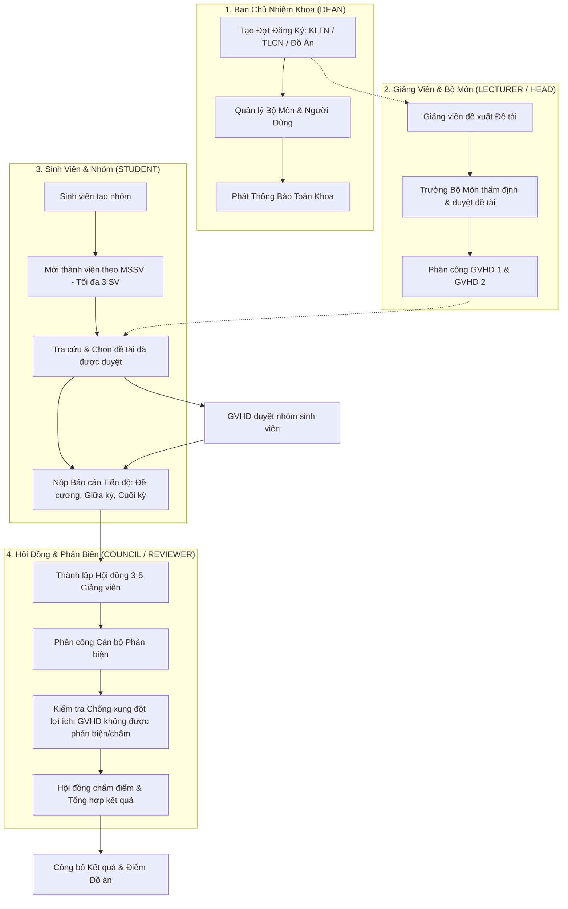

<div align="center">

# 🎓 HỆ THỐNG QUẢN LÝ ĐĂNG KÝ VÀ BẢO VỆ ĐỀ TÀI (KLTN - TLCN - ĐỒ ÁN)
### TRƯỜNG ĐẠI HỌC SƯ PHẠM KỸ THUẬT TP. HỒ CHÍ MINH (HCMUTE)
### KHOA CÔNG NGHỆ THÔNG TIN - MÔN HỌC LẬP TRÌNH WEB (WEPR330479)


</div>

---

## 👥 THÀNH VIÊN VÀ PHÂN CÔNG NHIỆM VỤ

| STT | MSSV | Họ và tên | Phân hệ phụ trách | Nhánh tính năng |
|:---:|:---:|---|---|---|
| 1️⃣ | **24110019** | **Lê Minh Huy** | **Sinh viên & Nhóm sinh viên**: Không gian nhóm, mời thành viên theo MSSV, chuyển giao nhóm trưởng, đăng ký đề tài, nộp báo cáo tiến độ các cột mốc | `sinhvien&nhomsinhvien` |
| 2️⃣ | **24110012** | **Trần Hữu Thành Đô** | **Phản biện, Hội đồng & Chấm điểm**: Thành lập hội đồng bảo vệ, kiểm tra điều kiện 3-5 thành viên, phân công GVPB, chấm điểm độc lập & chống xung đột lợi ích (GVHD không được phản biện/chấm) | `feature/phan-bien-hoi-dong-cham-diem` |
| 3️⃣ | **24162043** | **Lê Bảo Huy** | **Giảng viên & Đề tài**: Đề xuất đề tài, duyệt đề tài cấp bộ môn, phân công GVHD 1 & GVHD 2, xét duyệt nhóm sinh viên đăng ký đề tài | `feature-baohuy2603` |
| 4️⃣ | **24162048** | **Nguyễn Quang Huy** | **Trưởng khoa & Quản trị hệ thống**: Quản lý người dùng, quản lý bộ môn, đợt đăng ký theo niên khóa/học kỳ, phát thông báo toàn khoa | `feature/quanghuy2603` |
| 5️⃣ | **24110033** | **Lê Đăng Minh** | **Kiểm thử & Tài liệu**: Tham gia kiểm thử tích hợp chéo luồng dữ liệu, chuẩn hóa dữ liệu demo | `main` |

---

## 🏛️ KIẾN TRÚC HỆ THỐNG VÀ LUỒNG DỮ LIỆU TỔNG THỂ



---

## 🔑 TÀI KHOẢN MẪU DÙNG THỬ (DEMO ACCOUNTS)

Hệ thống đã nạp sẵn dữ liệu mẫu thực tế của Khoa CNTT - HCMUTE. Mật khẩu chung cho tất cả các tài khoản demo: `Password@123`

| Vai trò | Tên đăng nhập / MSSV | Mật khẩu | Họ và tên | Chức năng chính |
|---|---|---|---|---|
| **Trưởng Khoa (Dean)** | `dean` | `Password@123` | PGS.TS. Trần Văn Trưởng Khoa | Quản lý người dùng, bộ môn, đợt đăng ký, thông báo |
| **Trưởng Bộ Môn** | `head_cnpm` | `Password@123` | TS. Nguyễn Thị Trưởng Bộ Môn | Phê duyệt đề tài bộ môn, phân công GVHD |
| **Giảng Viên HD** | `lecturer1` | `Password@123` | TS. Nguyễn Hoàng Nam | Đề xuất đề tài, duyệt nhóm sinh viên, chấm tiến độ |
| **Giảng Viên PB** | `reviewer1` | `Password@123` | ThS. Vũ Hải Đăng | Thành viên hội đồng, chấm điểm phản biện |
| **Sinh Viên (Leader)** | `24110019` | `Password@123` | Lê Minh Huy | Trưởng nhóm, mời thành viên, đăng ký đề tài, nộp báo cáo |
| **Sinh Viên (Member)** | `24110012` | `Password@123` | Trần Hữu Thành Đô | Thành viên nhóm Alpha Dev Team |
| **Sinh Viên (Free)** | `22110001` | `Password@123` | Nguyễn Minh Anh | Sinh viên tự do nhận lời mời vào nhóm |

> 💡 *Trang đăng nhập (`/login`) và thanh điều hướng có sẵn nút chuyển đổi vai trò một chạm (Quick Switcher) giúp giảng viên và người đánh giá kiểm tra các luồng nghiệp vụ chỉ trong 1 giây.*

---

## 🚀 HƯỚNG DẪN CÀI ĐẶT & CHẠY DỰ ÁN

### 1. Yêu cầu môi trường
- **Java Development Kit (JDK):** Phiên bản 17 hoặc 21+.
- **Git** đã được cài đặt.
- **Maven Wrapper** (`mvnw` / `mvnw.cmd`) đã được tích hợp sẵn trong repo, **không cần cài đặt Maven rời**.

### 2. Chạy nhanh với cơ sở dữ liệu H2 (Mặc định - Không cần cài MySQL)
Database H2 in-memory chạy ở chế độ MySQL syntax compatibility, tự động tạo cấu trúc 13 bảng và nạp toàn bộ seed data khi khởi động:
```powershell
# Chạy trên Windows (PowerShell / Command Prompt)
.\mvnw.cmd spring-boot:run

# Hoặc trên Linux / macOS
./mvnw spring-boot:run
```
Sau khi khởi động thành công, truy cập:
- **Ứng dụng:** [http://localhost:8080](http://localhost:8080)
- **H2 Web Console:** [http://localhost:8080/h2-console](http://localhost:8080/h2-console) (JDBC URL: `jdbc:h2:mem:topicdb`, User: `sa`, Password: *(để trống)*)

### 3. Chạy với cơ sở dữ liệu MySQL
1. Khởi động MySQL Server và tạo cơ sở dữ liệu:
   ```sql
   CREATE DATABASE student_topic_management CHARACTER SET utf8mb4 COLLATE utf8mb4_unicode_ci;
   ```
2. Nạp schema và seed data từ thư mục `database/`:
   ```powershell
   mysql -u root -p student_topic_management < database/schema.sql
   mysql -u root -p student_topic_management < database/seed.sql
   ```
3. Khởi động ứng dụng với profile `mysql`:
   ```powershell
   .\mvnw.cmd spring-boot:run -Dspring-boot.run.profiles=mysql
   ```

### 4. Chạy kiểm thử tự động (Integration Test Suite)
```powershell
.\mvnw.cmd test
```
Toàn bộ 8 bài test tích hợp phủ kín cả 5 phân hệ cốt lõi đều tự động chạy và pass 100%.

---

## 📡 DANH SÁCH REST API ĐẶC TẢ

| Nhóm API | Phương thức | Đường dẫn URL | Mô tả chức năng |
|---|:---:|---|---|
| **Xác thực** | `GET` | `/api/auth/me` | Lấy thông tin tài khoản đang đăng nhập |
| **Quản trị (Dean)** | `GET, POST` | `/api/admin/users` | Danh sách & Thêm tài khoản mới |
| | `PUT, DELETE` | `/api/admin/users/{id}` | Cập nhật & Xóa tài khoản |
| | `GET, POST` | `/api/admin/departments` | Quản lý bộ môn chuyên ngành |
| | `GET, POST` | `/api/admin/registration-periods` | Thiết lập đợt đăng ký & hạn GVPB/Hội đồng |
| | `GET, POST` | `/api/admin/announcements` | Phát thông báo toàn khoa/giảng viên/sinh viên |
| **Giảng viên** | `GET, POST` | `/api/lecturer/topics` | Tra cứu & Đề xuất đề tài mới |
| | `GET` | `/api/lecturer/topics/my-topics` | Danh sách đề tài cá nhân hướng dẫn |
| | `PUT` | `/api/lecturer/department-topics/{id}/approval` | Trưởng BM phê duyệt đề tài |
| | `PUT` | `/api/lecturer/department-topics/{id}/assign-advisors` | Phân công GVHD 1 & GVHD 2 |
| | `PUT` | `/api/lecturer/department-topics/group-registrations/{id}/approval` | GVHD duyệt/từ chối nhóm sinh viên |
| **Sinh viên** | `GET` | `/api/student/workspace` | Toàn bộ trạng thái nhóm, lời mời & đề tài |
| | `POST` | `/api/student/groups` | Thành lập nhóm mới (tối đa 3 SV) |
| | `POST` | `/api/student/groups/invite` | Gửi lời mời tham gia nhóm theo MSSV |
| | `PUT` | `/api/student/invitations/{id}` | Chấp nhận hoặc từ chối lời mời vào nhóm |
| | `PUT` | `/api/student/groups/transfer-leader` | Chuyển giao quyền nhóm trưởng |
| | `POST` | `/api/student/topics/register` | Đăng ký đề tài đã được phê duyệt |
| | `POST` | `/api/student/reports` | Nộp báo cáo tiến độ (multipart file / link) |
| **Hội đồng & Điểm**| `GET, POST` | `/api/council` | Danh sách & Thành lập hội đồng bảo vệ |
| | `POST` | `/api/council/{id}/members` | Bổ nhiệm thành viên (Chủ tịch, Thư ký, GVPB, Ủy viên) |
| | `PUT` | `/api/council/{id}/ready` | Kiểm tra điều kiện 3-5 thành viên và kích hoạt READY |
| | `POST` | `/api/grading/assign` | Phân công hội đồng & cán bộ phản biện |
| | `POST` | `/api/grading/evaluate` | Chấm điểm bảo vệ (chống xung đột lợi ích) |

---

## 📜 LỊCH SỬ COMMIT TRÊN GITHUB

Dự án được phân chia thành chuỗi commit đơn nguyên, tường minh, chuẩn hóa theo quy ước [Conventional Commits](https://www.conventionalcommits.org/):

1. `4adbb77` - `chore(build): setup unified Spring Boot 3.5 project structure and dependencies`
2. `b27d22f` - `feat(db): create unified schema, JPA entities and comprehensive seed data`
3. `2c3ad70` - `feat(security): configure Spring Security 6, BCrypt password hashing and role access`
4. `1ed1900` - `feat(admin): implement Dean module for user, department, period and announcement management`
5. `daba1ba` - `feat(lecturer): implement Lecturer module for topic proposal and student group approval`
6. `a1dd676` - `feat(student): implement Student module for group collaboration and topic registration`
7. `faed041` - `feat(council): implement Reviewer assignment, Defense Council and Grading module`
8. `4bf7476` - `feat(ui): design unified dashboard shell, role navigation and responsive layouts`
9. `e134858` - `test: add comprehensive integration test suite covering all 5 core modules`
10. `docs: update system documentation, architecture diagrams and run instructions`

---
© 2026 HCMUTE - FIT. Đồ án Web Programming WEPR330479.
