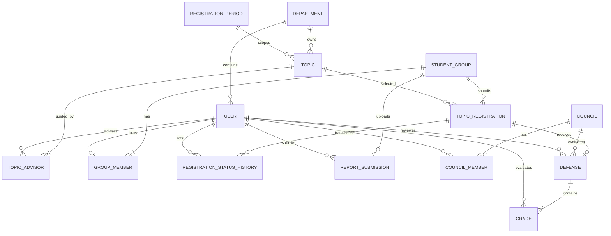

# Báo cáo audit hệ thống quản lý đề tài sinh viên

Ngày đánh giá: 26/09/2026  
Phạm vi: frontend, backend, database, authentication/authorization, upload file, kiến trúc, hiệu năng và kiểm thử.

## 1. Kết luận điều hành

Hệ thống đã có một luồng end-to-end chạy được cho các vai trò Trưởng khoa, Trưởng bộ môn, Giảng viên và Sinh viên. Các điểm mạnh rõ nhất là phân quyền URL ở backend, kiểm tra nghiệp vụ lại trong service, BCrypt, CSRF, khóa phiên khi tài khoản đổi trạng thái, ràng buộc nhóm tối đa ba người, kiểm tra thời gian đăng ký, kiểm tra chữ ký PDF/cấu trúc DOCX, và quy trình hội đồng–chấm điểm–công bố.

Hệ thống chưa nên đưa vào production thực tế nếu chưa xử lý các mục P1 sau:

1. Quy trình cài MySQL yêu cầu nạp `seed.sql`, trong khi tệp này tạo tài khoản demo dùng chung mật khẩu công khai `Demo@12345`; trang đăng nhập cũng luôn hiển thị các thông tin này.
2. Không có API/quyền để GVHD hoặc thành viên hội đồng xem và tải báo cáo của nhóm. Chức năng “hướng dẫn nhóm” vì thế mới dừng ở duyệt nhóm, chưa hỗ trợ nội dung báo cáo.
3. Không có trạng thái `CANCELLED` và không có bảng lịch sử thay đổi trạng thái; mỗi lần đăng ký lại ghi đè `student_groups.topic_id`, làm mất dấu vết đăng ký cũ.
4. Chưa có quy tắc hoặc cấu hình giới hạn số đề tài/nhóm mà một GV được hướng dẫn.
5. Danh sách báo cáo đọc `content.length`, khiến toàn bộ BLOB được nạp vào bộ nhớ; cùng với nhiều `findAll()` và truy vấn theo từng bản ghi, hệ thống sẽ xuống cấp nhanh khi dữ liệu tăng.

Không phát hiện bằng chứng về SQL injection trong code hiện tại: các truy vấn tùy biến dùng tham số JPQL, còn lại dùng Spring Data derived query. Các vị trí frontend dựng HTML từ dữ liệu động chính đã escape; tuy vậy chưa có Content Security Policy để giảm tác hại nếu một điểm XSS mới xuất hiện.

## 2. Bằng chứng và giới hạn đánh giá

- Đã đọc toàn bộ cây source và các tệp cấu hình/schema quan trọng.
- `mvn -B clean test`: thành công, 37 test, 0 failure, 0 error, 0 skipped.
- Tất cả tệp JavaScript trong `src/main/resources/static`: `node --check` thành công.
- `mvn -B dependency:tree -Dscope=runtime`: thành công; dependency được quản lý qua Spring Boot parent.
- Chưa chạy MySQL integration test vì không có credential/database MySQL được cung cấp.
- Chưa thực hiện pentest động, load test, SAST/SCA CVE chuyên dụng hoặc quét malware thực tế.
- Không giả định chức năng tồn tại nếu không thấy trong source.

## 3. Ma trận yêu cầu nghiệp vụ

| Yêu cầu | Đã có? | File/code/database liên quan | Hoàn thiện | Vấn đề phát hiện | Đề xuất |
|---|---|---|---:|---|---|
| 1. Quản lý đợt đăng ký | Có | `RegistrationPeriod`, `RegistrationPeriodServiceV2`, `ApiRegistrationPeriodController`, `registration_periods` | 90% | Có đủ 4 loại, hai cửa sổ GV/SV, deadline GVPB và ngày hội đồng theo loại; service và DB kiểm tra thứ tự thời gian. Chưa có lifecycle/status của đợt; vẫn có thể sửa/xóa mốc thời gian sau khi đã phát sinh đề tài/đăng ký. | Thêm trạng thái `DRAFT/OPEN/CLOSED/ARCHIVED`; cấm sửa trường trọng yếu sau khi mở; thay xóa cứng bằng archive; thêm integration test MySQL cho CHECK constraint. |
| 2. Quản lý đề tài | Một phần tốt | `Topic`, `TopicService`, `DepartmentTopicService`, `topics` | 72% | Quan hệ Department–Topic–Teacher có; tối đa hai GVHD bằng hai cột. `description` vẫn nullable và DTO không bắt buộc; DB cho phép đề tài approved không có GVHD; không giới hạn tải hướng dẫn của GV; mô hình `advisor1/advisor2` khó mở rộng. | Bắt buộc mô tả; thêm policy tải GV theo đợt/loại; chuyển sang `topic_advisors(topic_id, lecturer_id, position)` với unique và kiểm tra tối đa 2. |
| 3. Sinh viên đăng ký theo nhóm | Có | `StudentGroup`, `GroupMember`, `StudentService`, `student_groups`, `group_members` | 86% | Có nhóm trưởng, unique `student_id`, tối đa 3 ở service và `member_count`. Nhưng `member_count` có thể lệch với số dòng thật; DB không bảo đảm leader là một thành viên; không có thao tác rời/xóa thành viên. | Bỏ `member_count` hoặc duy trì bằng trigger/locking; kiểm tra leader thuộc nhóm; thêm luồng rời/xóa/chuyển trưởng nhóm có audit; test cạnh tranh đồng thời. |
| 4. Duyệt/từ chối đăng ký đề tài | Một phần | `GroupStatus`, `StudentGroupService`, `TopicStatus`, `DepartmentTopicService` | 58% | Có `PENDING/APPROVED/REJECTED`, nhưng không có `CANCELLED`; không có lịch sử trạng thái/ai duyệt/lúc nào; đăng ký lại ghi đè topic và notes cũ. | Tách `topic_registrations` khỏi `student_groups`; thêm `status`, `decided_by`, `decided_at`, `reason`; thêm bảng `registration_status_history`; triển khai cancel có điều kiện. |
| 5. GVHD/GVPB | Có phần chính | `Topic.advisor1/advisor2`, `CouncilMember.role`, `Defense.reviewer`, `CouncilService` | 85% | Có phân biệt và service chặn GVHD chấm đề tài mình; khi phân công còn cấm toàn bộ GVHD nằm trong hội đồng. Chưa có tải GVHD; invariant reviewer thuộc hội đồng chỉ nằm ở service, DB không bảo vệ. | Thêm quota; thêm bảng vai trò chuẩn hóa; audit phân công; cân nhắc constraint/trigger hoặc validation định kỳ cho reviewer–council. |
| 6. Nộp báo cáo | Một phần tốt | `StudentController`, `StudentService.upload`, `Report`, `student_reports` | 82% | Chỉ nhóm trưởng và nhóm approved được nộp; giới hạn 10 MB; kiểm extension + magic bytes PDF + cấu trúc/độ nở DOCX; tên file được làm sạch. Không có malware scan; GVHD/GVPB không có quyền tải; lưu BLOB trong DB; không có hạn nộp báo cáo. | Cho GVHD/thành viên hội đồng tải theo record-level authorization; lưu object storage ngoài web root; thêm antivirus/CDR; checksum; retention; nếu nghiệp vụ cần, thêm deadline báo cáo theo giai đoạn. |
| 7. Hội đồng phản biện | Có | `Council`, `CouncilMember`, `CouncilService.create`, `councils`, `council_members` | 90% | Service kiểm tra 3–5 người, duy nhất một Chủ tịch, một Thư ký, ít nhất một Reviewer. DB chỉ kiểm enum và unique người/hội đồng, không bảo vệ số lượng/vai trò. Không có sửa/hủy hội đồng. | Thêm API update/cancel với optimistic lock; kiểm tra xung đột lịch/phòng/GV; thêm validation DB/trigger nếu cần chống dữ liệu ngoài ứng dụng. |
| 8. Chấm điểm | Có | `Grade`, `Defense`, `CouncilService.grade/finalizeScore`, `defense_grades` | 92% | Điểm 0–10, tối đa 2 số thập phân; evaluator lấy từ phiên; GVHD bị chặn; Chủ tịch chỉ tổng hợp khi đủ điểm; trung bình cộng và làm tròn HALF_UP. Chưa có rubric/điểm thành phần đúng nghĩa, chỉ có một điểm mỗi giảng viên; chưa có phúc khảo/mở khóa. | Nếu “điểm thành phần” là tiêu chí, thêm `rubrics`, `criteria`, `grade_items`; lưu phiên bản công thức; quy trình điều chỉnh có phê duyệt và audit. |
| 9. Công bố kết quả | Có | `CouncilService.publish/studentResult`, `/api/student/result` | 95% | Chỉ Trưởng khoa công bố; sinh viên được tra theo membership của chính mình và chỉ khi published. Không có bản chụp bất biến/audit thời điểm công bố. | Lưu `published_by`, `published_at`, snapshot điểm; thêm khả năng thu hồi/công bố lại theo workflow có audit. |

Đánh giá nghiệp vụ tổng hợp: khoảng **83%**. Tỷ lệ này phản ánh “luồng chính chạy được”, không có nghĩa hệ thống đã sẵn sàng production.

## 4. Các phát hiện theo mức độ ưu tiên

### P1 — cần sửa trước production

#### P1.1 Tài khoản demo/mật khẩu công khai có thể đi vào MySQL triển khai

- `README.md` hướng dẫn chạy cả `database/schema.sql` và `database/seed.sql` cho MySQL.
- `database/seed.sql` khai báo mọi tài khoản dùng mật khẩu `Demo@12345`.
- `login.html` luôn hiển thị mật khẩu và nút điền nhanh, không phụ thuộc profile.
- `spring.profiles.default=demo` làm ứng dụng tự rơi về chế độ demo nếu người vận hành quên chỉ định profile.

Rủi ro: chiếm quyền Trưởng khoa/Giảng viên/Sinh viên nếu dữ liệu seed được dùng ở môi trường có thể truy cập.

Khắc phục:

1. Không nạp seed demo trong hướng dẫn production.
2. Tách `db/migration` và `db/demo`; demo credentials chỉ render khi profile `demo`.
3. Production phải fail-fast nếu profile hoặc biến môi trường bắt buộc bị thiếu.
4. Buộc đổi mật khẩu lần đầu; vô hiệu hóa hoặc xóa mọi tài khoản seed trước khi mở truy cập.

#### P1.2 GVHD và hội đồng không thể truy cập báo cáo

Tất cả API báo cáo nằm dưới `/api/student/reports`; download chỉ cho thành viên đúng nhóm. Không tìm thấy endpoint cho advisor, reviewer hay council member. Đây là thiếu chức năng nghiệp vụ, không chỉ thiếu UI.

Khắc phục: tạo `ReportAccessPolicy` và endpoint staff. Cho phép khi người dùng là GVHD của topic, thành viên hội đồng của defense, hoặc Trưởng khoa; ghi audit khi tải.

#### P1.3 Thiếu lịch sử và trạng thái hủy

`TopicStatus` chỉ có `PENDING/APPROVED/REJECTED`; `GroupStatus` có thêm `DRAFT` nhưng vẫn thiếu `CANCELLED`. Không có bảng lịch sử. Khi nhóm bị từ chối rồi chọn đề tài khác, `topic_id`, `registered_at` và `notes` bị ghi đè.

Khắc phục: tạo entity đăng ký riêng và append-only history. Không dùng bản ghi nhóm làm cả “nhóm” lẫn “đăng ký”.

#### P1.4 Không kiểm soát tải hướng dẫn của giảng viên

`assignAdvisors` chỉ kiểm tra hai GV khác nhau và là staff; không đếm số đề tài/nhóm theo đợt. Yêu cầu “GV không thể hướng dẫn quá số lượng” chưa được triển khai và chưa có nơi cấu hình số tối đa.

Khắc phục: thêm `advisor_load_limits(period_id, lecturer_id hoặc role/type, max_groups)`; đếm assignment approved trong cùng transaction và lock hàng quota trước khi gán.

#### P1.5 Tải BLOB hàng loạt và N+1

- `StudentService.state` truy cập `f.content.length` cho mọi báo cáo, buộc nạp toàn bộ tệp dù `@Basic(fetch=LAZY)`.
- `StudentService.catalog` chạy `groups.findByTopicId` cho từng đề tài.
- `CouncilService.state/defenseView` chạy `grades.findByDefenseId` cho từng defense.
- Dashboard và nhiều màn hình gọi `findAll()` rồi lọc trong Java.

Khắc phục: thêm cột `file_size`, projection metadata, object storage; aggregate query `count by topic`; fetch graph/batch query cho grade; pagination; `countBy...` ở repository.

### P2 — lỗi trung bình

- `member_count` là dữ liệu dẫn xuất và có thể lệch khỏi `group_members`; `leader_id` cũng lặp thông tin với member role.
- `Topic.description` nullable ở entity/schema và không có `@NotBlank` trong DTO, trái yêu cầu đề tài có nội dung mô tả.
- Validation quan trọng của council, reviewer, leader và advisor chỉ nằm ở application layer; import SQL hoặc code khác có thể tạo dữ liệu sai.
- Upload chưa có antivirus/CDR. Kiểm magic bytes làm giảm giả mạo đơn giản nhưng không chứng minh tệp an toàn.
- Login throttling lưu trong RAM từng instance và khóa theo cặp IP + identifier; có thể né bằng phân tán IP/tài khoản, đồng thời không hoạt động nhất quán khi scale-out.
- Không cấu hình rõ session timeout, số phiên đồng thời, re-authentication cho thao tác nhạy cảm hoặc đổi mật khẩu.
- Chưa có CSP; đang dùng nhiều inline style/inline handler nên việc thêm CSP sẽ cần refactor.
- `AuditAspect` chỉ log tên hàm và thời gian ở mức debug, không phải audit trail: không có actor, target, before/after, outcome, IP hay correlation ID.
- `application.properties` dùng `ddl-auto=update`; schema thực tế có thể trôi. Chưa có Flyway/Liquibase.
- H2 database `data/integrated-project.mv.db` nằm trong project; không nên commit dữ liệu runtime hoặc hash tài khoản.
- Không có pagination trên tài khoản, đề tài, nhóm, thông báo, hội đồng.
- Chưa có kiểm tra xung đột lịch/phòng/thành viên hội đồng.

### P3 — cải tiến

- Chuẩn hóa package từ `topicmanagement` thành `vn.edu.hcmute.topicmanagement` để khớp Maven groupId.
- Loại hậu tố `V2` khi phiên bản cũ không còn là API công khai; hợp nhất `UserService` và `UserServiceV2` theo trách nhiệm rõ ràng.
- Không trộn field injection và constructor injection trong controller.
- Thay `Map<String,Object>` và entity public field bằng request/response DTO có kiểu.
- Tách `StudentService` và `CouncilService` thành các use-case nhỏ hơn; code hiện dày, nhiều câu lệnh trên một dòng, khó review/maintain.
- Thêm OpenAPI và error code ổn định thay vì chỉ message tiếng Việt.
- Build còn cảnh báo `AntPathRequestMatcher` đã deprecated/được đánh dấu sẽ loại bỏ; nên chuyển sang matcher API hiện hành. Test cũng cảnh báo Mockito tự gắn Java agent sẽ bị chặn ở JDK tương lai, nên cấu hình test agent chính thức.

## 5. Database design

### 5.1 Chuẩn hóa

- 1NF: nhìn chung đạt; các cột là atomic.
- 2NF: đạt với khóa chính surrogate ở các bảng hiện có.
- 3NF: chưa hoàn toàn. `student_groups.member_count` phụ thuộc vào tập `group_members`; `leader_id` và `group_members.member_role=LEADER` mô tả cùng một sự thật; `topics.topic_type` lặp loại của `registration_periods`; `defenses.final_score` là giá trị dẫn xuất từ `defense_grades`.

Không nhất thiết phải xóa mọi dữ liệu dẫn xuất, nhưng nếu giữ cần có một nguồn sự thật, constraint/trigger hoặc service transaction đảm bảo đồng bộ.

### 5.2 Constraint hiện có

Điểm tốt:

- PK/FK được khai báo đầy đủ cho các quan hệ chính.
- Unique cho username, email, mã người dùng, mã đề tài, mã nhóm, mã hội đồng.
- `group_members.student_id` unique đảm bảo một sinh viên chỉ thuộc một nhóm.
- Unique `(defense_id, evaluator_id)` ngăn chấm trùng.
- CHECK cho enum, thời gian, kích thước nhóm khai báo, điểm 0–10.
- Cascade delete hợp lý ở member/invitation/report/grade con.

Khoảng trống:

- Không bảo đảm số dòng member thực tế ≤ 3.
- Không bảo đảm leader là member và chỉ đúng một LEADER.
- Không bảo đảm topic approved có 1–2 advisor.
- Không bảo đảm advisor/reviewer/council member mang role hợp lệ ở DB.
- Không bảo đảm reviewer thuộc đúng council của defense.
- Không có status history, `decided_by`, `published_by`, `created_by` cho nhiều thao tác quan trọng.
- Không có index chuyên cho các truy vấn thường dùng như invitation theo `(student_id,status,created_at)`, report theo `(group_id,submitted_at)`, period theo các mốc thời gian. Một số FK index có thể được MySQL tự tạo nhưng nên khai báo theo query plan.

### 5.3 ERD đề xuất



Thiết kế này giữ `STUDENT_GROUP` ổn định, còn mỗi lần chọn/đổi/hủy đề tài là một `TOPIC_REGISTRATION`. `REPORT_SUBMISSION` chỉ giữ metadata, checksum và object key; nội dung tệp đặt ở object storage private.

## 6. Kiến trúc source code

Kiến trúc hiện tại là Spring MVC/layered architecture, có controller–service–repository–entity–DTO–security–exception. Controller nhìn chung mỏng, business rule chính nằm trong service, và có exception handler tập trung. Đây là nền tảng tốt.

Các vấn đề maintainability:

- Tổ chức package không nhất quán: phần lớn theo layer, riêng `student` và `council` theo feature.
- DTO tốt ở admin/topic nhưng module student/council trả `Map`, làm contract lỏng và khó sinh tài liệu/test.
- `StudentService` và `CouncilService` gánh nhiều use case, mapping response và validation trong cùng class.
- Entity trong module student/council dùng public field, còn entity lõi dùng private field/getter; style không nhất quán.
- `UserService` và `UserServiceV2` gây mơ hồ phiên bản/trách nhiệm.

Cấu trúc đề xuất:

```text
vn.edu.hcmute.topicmanagement
├── common
│   ├── api
│   ├── exception
│   ├── security
│   └── audit
├── identity
│   ├── api / application / domain / infrastructure
├── registrationperiod
│   ├── api / application / domain / infrastructure
├── topic
│   ├── api / application / domain / infrastructure
├── studentgroup
│   ├── api / application / domain / infrastructure
├── submission
│   ├── api / application / domain / infrastructure
└── defense
    ├── api / application / domain / infrastructure
```

Không cần chuyển sang microservice. Một modular monolith với boundary rõ là phù hợp hơn quy mô hiện tại.

## 7. Security audit

| Hạng mục | Kết quả | Nhận xét |
|---|---|---|
| Password storage | Tốt | BCrypt cho tài khoản mới; legacy PBKDF2 được kiểm an toàn tương đối và nâng cấp sang BCrypt sau login. Không thấy lưu plaintext trong DB/source. |
| Authentication | Khá | Thông báo lỗi chung; account status được kiểm; session ID đổi khi phiên đã tồn tại. Thiếu password policy mạnh, MFA và forced password change. |
| Authorization | Khá tốt | URL rules ở Spring Security và record-level checks trong service cho nhóm/report/grade. Endpoint chỉ đọc danh sách đề tài bộ môn cho phép staff query bộ môn tùy ý; mutation vẫn được policy chặn. |
| Session/logout | Khá | HTTP Session, HttpOnly, SameSite=Lax; profile MySQL mặc định Secure=true; logout invalidates context. Chưa cấu hình timeout/concurrent sessions rõ ràng. |
| CSRF | Tốt | Cookie token repository và header; test xác nhận POST thiếu token bị 403. |
| SQL injection | Tốt | Không thấy nối chuỗi SQL; JPQL dùng named parameter. |
| XSS | Khá | Các renderer chính dùng escape/textContent. Chưa có CSP và còn nhiều HTML template string/inline handler làm tăng rủi ro regression. |
| Upload | Khá | Size, extension, magic bytes, DOCX ZIP bound, filename cleanup, attachment download. Thiếu malware scan/CDR/checksum và quyền đọc cho staff hợp lệ. |
| Sensitive data | Có lỗi nghiêm trọng | Không hardcode DB secret production, nhưng demo password công khai và seed production workflow không an toàn. H2 runtime DB được đặt trong project. |
| Audit/monitoring | Yếu | Chưa có security/business audit trail bền vững; chưa có metrics/alert cho login failure, upload rejection, denied access. |

Avatar upload: không tìm thấy chức năng upload avatar, nên không có code để đánh giá. Nếu bổ sung sau này, áp dụng cùng pipeline lưu trữ private, decode/re-encode ảnh, giới hạn pixel/kích thước và bỏ metadata.

## 8. Frontend/UI

Đã có các màn hình chính:

- Trưởng khoa: dashboard, tài khoản/GV, bộ môn, đợt đăng ký, thông báo, đề tài/nhóm qua khu vực lecturer, hội đồng và công bố kết quả.
- Giảng viên/Trưởng bộ môn: dashboard, đề xuất/sửa/xóa đề tài, duyệt đề tài bộ môn, gán GVHD, duyệt nhóm, hội đồng/chấm điểm.
- Sinh viên: dashboard, nhóm/lời mời/chuyển trưởng nhóm, kho đề tài, trạng thái đăng ký, nộp/tải báo cáo, xem điểm.

Điểm tốt: giao diện tách theo vai trò, có client validation, loading/error state, responsive media query, escape dữ liệu động ở các bảng chính, và backend không dựa vào việc ẩn nút.

Thiếu/hạn chế:

- Không có màn hình GVHD xem báo cáo/nhận xét tiến độ nhóm.
- Không có luồng cancel, rời nhóm, xóa thành viên, lịch sử duyệt.
- “Quản lý GV” được gộp vào tài khoản; chấp nhận được nhưng chưa có workload/advisor overview.
- Client render phần lớn bằng chuỗi `innerHTML`; đang escape khá tốt nhưng dễ bị lỗi khi thêm field mới. Ưu tiên DOM API/component nhỏ hoặc helper bắt buộc escape.
- Chưa có automated accessibility test; một số trang lecturer dùng nhiều style inline và icon emoji, cần kiểm contrast, keyboard và screen reader thực tế.

## 9. Hiệu năng

Ưu tiên tối ưu theo thứ tự:

1. Không đọc BLOB khi chỉ cần metadata; thêm `file_size` và projection.
2. Pagination mọi danh sách; đặt giới hạn tối đa cho search.
3. Thay lọc `findAll()` bằng query/count ở DB.
4. Giải quyết N+1 ở catalog topic/group và defense/grade bằng aggregate query/entity graph.
5. Chuyển các quan hệ EAGER không bắt buộc sang LAZY; DTO query lấy đúng cột.
6. Thêm index dựa trên `EXPLAIN`, không thêm cache trước khi sửa query.
7. Cache chỉ phù hợp cho danh mục ít đổi như department/period; phải invalidate rõ.

## 10. Testing

Test hiện có bao phủ tốt các rule cốt lõi: thời gian đợt, role/CSRF/session refresh, giới hạn nhóm, đăng ký, fake PDF, hội đồng, điểm và công bố.

Các test quan trọng cần bổ sung:

1. MySQL Testcontainers chạy `schema.sql`/migration và `ddl-auto=validate`.
2. Concurrent accept invitation cuối cùng để chứng minh không vượt ba thành viên.
3. Concurrent advisor assignment/quota.
4. Topic approved luôn có 1–2 advisor; description bắt buộc.
5. Cancel và toàn bộ transition hợp lệ/không hợp lệ; history không thể bị ghi đè.
6. GVHD đọc báo cáo của topic mình; GV khác bị 403; council member chỉ đọc defense được phân công.
7. PDF polyglot, malformed PDF, DOCX zip bomb, quá 1.000 entry, MIME giả, filename Unicode/control character.
8. Báo cáo 10 MB x nhiều bản ghi: API state không tải BLOB và không tăng heap tuyến tính.
9. Pagination/filter/query-count để phát hiện N+1.
10. Login spray theo IP/tài khoản, proxy header policy, multi-instance rate limit.
11. Session timeout, concurrent session, logout CSRF, cookie flags trên HTTPS.
12. Stored XSS cho mọi field hiển thị: topic title/description, notes, announcement, filename, grade comment.
13. Council schedule conflict và reviewer/council invariant.
14. Không thể sửa period đang active nếu thay đổi làm vô hiệu dữ liệu đã phát sinh.
15. Accessibility smoke test bằng axe và keyboard-only cho ba role.

## 11. Điểm tổng thể

| Tiêu chí | Điểm / 10 | Nhận định |
|---|---:|---|
| Nghiệp vụ | 7.8 | Luồng chính đầy đủ, thiếu history/cancel, advisor quota và staff report access. |
| Kiến trúc | 7.2 | Layering tốt, nhưng boundary/style/DTO chưa nhất quán và service còn quá lớn. |
| Database | 7.0 | Quan hệ/constraint nền tảng khá, còn dữ liệu dẫn xuất và invariant chỉ được bảo vệ ở service. |
| Security | 7.1 | Nhiều control tốt; demo credential/seed workflow, malware/audit/session hardening cần sửa. |
| Code quality | 7.3 | Build/test sạch; một số class khó đọc, tên V2/duplicate service và public field làm giảm maintainability. |
| UI/UX | 7.8 | Đủ màn hình chính, responsive và role-aware; thiếu luồng hướng dẫn/báo cáo cho GV và accessibility automation. |
| **Tổng hợp** | **7.4** | **Phù hợp demo/đồ án tốt; chưa sẵn sàng production thật nếu chưa xử lý P1.** |

## 12. Lộ trình cải thiện đề xuất

### Sprint 1 — an toàn và đúng nghiệp vụ

- Tách/khóa demo profile, bỏ seed demo khỏi production, forced password change.
- Thêm staff report access với policy và audit.
- Thêm advisor quota.
- Thiết kế `topic_registrations` + `status_history` + `CANCELLED`.
- Bắt buộc topic description.

### Sprint 2 — dữ liệu và hiệu năng

- Flyway/Liquibase; bỏ `ddl-auto=update` ngoài local.
- Tách report metadata khỏi BLOB/object storage.
- Pagination, aggregate query, loại N+1 và EAGER không cần thiết.
- Bổ sung MySQL Testcontainers và concurrency tests.

### Sprint 3 — hardening và vận hành

- Antivirus/CDR, checksum và retention cho upload.
- Redis/gateway rate limit, session policy, CSP sau khi bỏ inline handler/style.
- Audit log bất biến, metrics/alerts, SAST/SCA/DAST trong CI.
- Accessibility và load test theo dữ liệu mục tiêu.
