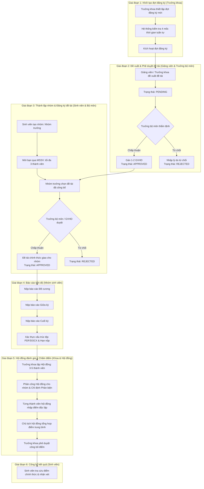

# Quy trình nghiệp vụ: Hệ thống Quản lý Đề tài Sinh viên HCM-UTE

## 1. Sơ đồ luồng nghiệp vụ toàn diện (End-to-End Workflow)

---

## 2. Giai đoạn 1: Vòng đời đợt đăng ký & Quy tắc thời gian

### 2.1 Bốn mốc thời gian tuần tự
Mỗi đợt đăng ký bắt buộc tuân thủ thứ tự thời gian nghiêm ngặt:
$$\text{lecturer\_start\_at} < \text{lecturer\_end\_at} < \text{student\_start\_at} < \text{student\_end\_at}$$

1. **Cửa sổ đề xuất của Giảng viên** (`lecturer_start_at` $\rightarrow$ `lecturer_end_at`):
   - Giảng viên và Trưởng khoa khởi tạo, chỉnh sửa hoặc rút lại các đề xuất đề tài.
   - Trưởng bộ môn tiến hành thẩm định và duyệt đề tài.
2. **Cửa sổ đăng ký của Sinh viên** (`student_start_at` $\rightarrow$ `student_end_at`):
   - Chức năng chỉnh sửa đề tài của giảng viên tự động bị khóa.
   - Danh mục đề tài đã duyệt (`APPROVED`) hiển thị công khai cho sinh viên tìm kiếm và đăng ký.
3. **Hạn chót báo cáo & Ngày bảo vệ**:
   - Đối với loại hình `TLCN` và `KLTN`, hệ thống yêu cầu cấu hình `review_deadline` sau thời điểm sinh viên kết thúc đăng ký.
   - Đối với `KLTN`, ngày tổ chức hội đồng bảo vệ (`defense_date`) phải diễn ra sau hạn chót nộp báo cáo.

### 2.2 Quy tắc bảo vệ toàn vẹn đợt đăng ký
- **Ngăn chặn đổi loại hình đợt**: Trả về lỗi `409 Conflict` nếu người dùng cố gắng đổi loại hình của đợt (`COURSE`, `NCKH`, `TLCN`, `KLTN`) khi đợt đó đã có đề tài phát sinh.
- **Ngăn chặn xóa đợt đăng ký**: Trả về lỗi `409 Conflict` nếu xóa đợt đăng ký đang chứa đề tài hoặc nhóm sinh viên.

---

## 3. Giai đoạn 2: Đề xuất & Thẩm định đề tài

### 3.1 Quy tắc đề xuất đề tài
- **Giảng viên (`ROLE_LECTURER`)**: Chỉ được đề xuất đề tài thuộc đúng bộ môn chuyên môn mà tài khoản được phân công (`department_id`).
- **Trưởng khoa (`ROLE_DEAN`)**: Có thẩm quyền đề xuất đề tài liên ngành hoặc cấp khoa cho bất kỳ bộ môn nào.
- **Thông tin đề tài**: Tên đề tài, mô tả chi tiết ($\ge 10$ ký tự), yêu cầu đầu vào, số lượng sinh viên tối đa (1–3 sinh viên) và hình thức đề tài.

### 3.2 Quy trình thẩm định của Trưởng bộ môn (`ROLE_HEAD_OF_DEPT`)
- Trưởng bộ môn theo dõi các đề tài có trạng thái `PENDING` trong bộ môn mình phụ trách.
- **Phê duyệt (`APPROVE`)**:
  - Người tạo đề tài phải đang ở trạng thái hoạt động (`ACTIVE`).
  - Giảng viên hướng dẫn chính (`advisor1`) phải thuộc đúng bộ môn.
  - Giảng viên hướng dẫn phụ (`advisor2`) là tùy chọn, nhưng nếu có thì phải khác với giảng viên hướng dẫn chính.
  - Sau khi duyệt, đề tài tự động chuyển sang trạng thái sẵn sàng để sinh viên đăng ký.
- **Từ chối (`REJECT`)**: Yêu cầu nhập lý do từ chối cụ thể (`rejection_reason`) để phản hồi cho giảng viên đề xuất.

---

## 4. Giai đoạn 3: Thành lập nhóm & Đăng ký đề tài

### 4.1 Quy tắc thành lập nhóm & Phạm vi theo đợt
1. Sinh viên khởi tạo nhóm sẽ tự động đảm nhiệm vai trò **Nhóm trưởng** (`ROLE_LEADER`).
2. **Cô lập theo đợt (`Period Scoping`)**: Một sinh viên chỉ được tham gia tối đa **một nhóm trong một đợt đăng ký cụ thể** (ràng buộc bằng khóa duy nhất `uk_group_member_period_student`).
3. **Quy trình mời thành viên**:
   - Nhóm trưởng gửi lời mời qua Mã số sinh viên (MSSV).
   - Quy mô nhóm tối đa là 3 sinh viên.
   - Sinh viên được mời có thể bấm **Đồng ý** (gia nhập nhóm) hoặc **Từ chối**.

### 4.2 Thao tác quản lý nhóm & Cơ chế an toàn
- **Rời nhóm (`POST /api/student/groups/leave`)**: Thành viên thường có thể rời nhóm nếu nhóm chưa đăng ký đề tài.
- **Xóa thành viên (`POST /api/student/groups/members/remove`)**: Nhóm trưởng có quyền xóa thành viên ra khỏi nhóm khi nhóm chưa đăng ký đề tài.
- **Giải tán nhóm (`POST /api/student/groups/disband`)**: Nhóm trưởng có quyền giải tán toàn bộ nhóm khi chưa đăng ký đề tài.

### 4.3 Đăng ký đề tài & Khóa bảo vệ hủy đăng ký
- Chỉ Nhóm trưởng mới có quyền đại diện nhóm đăng ký đề tài trong cửa sổ thời gian quy định.
- Trưởng bộ môn hoặc Giảng viên hướng dẫn duyệt đơn đăng ký của nhóm.
- **Khóa bảo vệ hủy đăng ký (`assertCanCancel`)**:
  - Nhóm bị nghiêm cấm hủy đăng ký (`409 Conflict`) nếu rơi vào một trong hai trường hợp:
    1. Nhóm đã nộp ít nhất một báo cáo tiến độ.
    2. Đề tài của nhóm đã được phân công hoặc lên lịch chấm hội đồng bảo vệ.

---

## 5. Giai đoạn 4: Báo cáo tiến độ & Xác thực tài liệu

### 5.1 Tiến trình 3 giai đoạn tuyến tính
Hệ thống yêu cầu nộp báo cáo theo đúng thứ tự logic. Mọi nỗ lực nhảy cóc giai đoạn sẽ bị từ chối với mã lỗi `400 Bad Request`:
1. **Giai đoạn 1**: Đề cương chi tiết (**Đề cương**)
2. **Giai đoạn 2**: Báo cáo tiến độ giữa kỳ (**Giữa kỳ**) — Yêu cầu đã hoàn thành Giai đoạn 1.
3. **Giai đoạn 3**: Khóa luận / Báo cáo hoàn chỉnh (**Cuối kỳ**) — Yêu cầu đã hoàn thành Giai đoạn 2.

### 5.2 Xác thực cấu trúc tệp an toàn
Các tệp đính kèm được kiểm tra cấu trúc byte trước khi chấp nhận lưu trữ:
- **Định dạng cho phép**: Tệp PDF (`application/pdf`) và tệp Word OpenXML (`.docx`).
- **Cấu trúc PDF**: Kiểm tra chuỗi byte định danh `%PDF-`, ký hiệu kết thúc `%%EOF`, và các khối đối tượng `obj`.
- **Dung lượng tối đa**: Không vượt quá 10 MB.
- **Kiểm soát hạn nộp**: So sánh thời điểm nộp với mốc `review_deadline` của đợt. Bài nộp sau thời hạn sẽ bị đánh dấu `late = true` hoặc từ chối theo cấu hình.

---

## 6. Giai đoạn 5: Hội đồng đánh giá & Tổng hợp điểm số

### 6.1 Cơ cấu hội đồng đánh giá
- Do Trưởng khoa (`ROLE_DEAN`) thành lập.
- Số lượng thành viên: Từ **3 đến 5 giảng viên**.
- Phân bổ chức danh bắt buộc:
  - Đúng 1 **Chủ tịch hội đồng (`CHAIRPERSON`)**
  - Đúng 1 **Thư ký hội đồng (`SECRETARY`)**
  - Ít nhất 1 **Giảng viên phản biện (`REVIEWER`)**
  - Từ 0 đến 2 **Ủy viên (`MEMBER`)**
- Cho phép điều chỉnh thành viên hội đồng tại chỗ khi chưa có điểm số nào được nhập.

### 6.2 Phân công bảo vệ & Phòng ngừa xung đột lợi ích
- Trưởng khoa phân công Hội đồng chấm và chỉ định Giảng viên phản biện (`GVPB`) cho từng nhóm sinh viên.
- **Kiểm tra xung đột lợi ích**: Nếu bất kỳ thành viên nào trong hội đồng là giảng viên hướng dẫn của đề tài, hệ thống lập tức ngăn chặn việc phân công.

### 6.3 Chấm điểm độc lập & Tổng hợp tự động
1. Từng thành viên hội đồng nhập điểm số cá nhân ($0.00 \le \text{điểm} \le 10.00$) kèm nhận xét đánh giá chi tiết.
2. Chủ tịch hội đồng kiểm tra trạng thái nhập điểm của toàn bộ thành viên.
3. Khi đã thu thập đủ điểm, Chủ tịch bấm nút **Tổng hợp điểm**:
   $$\text{Điểm chung cuộc} = \frac{1}{N} \sum_{i=1}^N \text{Điểm}_i \quad (\text{làm tròn 2 chữ số thập phân})$$
4. Bản ghi bảo vệ chuyển sang trạng thái hoàn tất (`finalized = true`).

---

## 7. Giai đoạn 6: Công bố kết quả & Cơ chế tra cứu đa đợt

### 7.1 Công bố kết quả học tập
- Trưởng khoa kiểm tra danh sách các nhóm đã hoàn tất đánh giá và bấm **Công bố kết quả** (`published = true`).
- Toàn bộ điểm số tổng hợp và nhận xét của từng thành viên hội đồng sẽ hiển thị công khai trên giao diện của sinh viên thuộc nhóm.

### 7.2 Cơ chế phân giải kết quả đa đợt của sinh viên
Khi sinh viên truy cập màn hình kết quả đánh giá (`GET /api/student/result`):
- Trong trường hợp sinh viên có lịch sử tham gia nhiều nhóm ở các đợt khác nhau, hệ thống:
  1. Tự động kiểm tra và ưu tiên hiển thị kết quả của đợt đăng ký đang hoạt động.
  2. Nếu không có đợt nào đang mở, hệ thống tự động chọn đợt hoàn thành gần nhất theo tiêu chí: ngày kết thúc đợt, ngày bảo vệ, và ID đợt giảm dần.
  3. Tuyệt đối không trả về ngẫu nhiên nhóm đầu tiên trong cơ sở dữ liệu.
  4. Hỗ trợ sinh viên chủ động chọn xem lại kết quả của bất kỳ đợt lịch sử nào qua tham số `?periodId={id}`.
