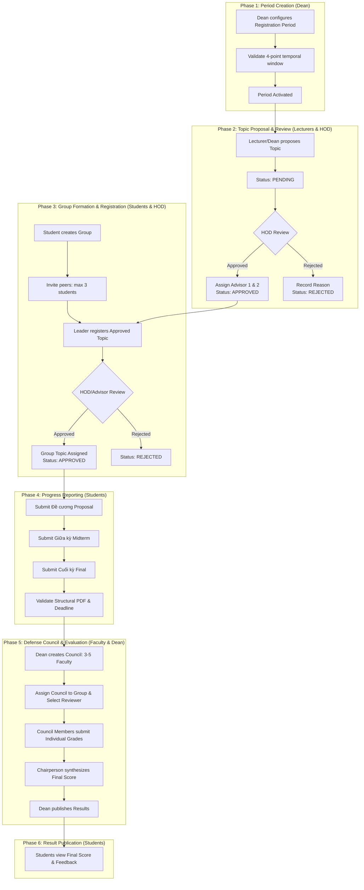

# Business Workflow: HCM-UTE Student Topic Management System

## 1. End-to-End Workflow Diagram

---

## 2. Phase 1: Registration Period Lifecycle

### 2.1 Four-Point Temporal Window
Every registration period enforces a strict chronological sequence:
$$\text{lecturer\_start\_at} < \text{lecturer\_end\_at} < \text{student\_start\_at} < \text{student\_end\_at}$$

1. **Lecturer Proposal Window** (`lecturer_start_at` $\rightarrow$ `lecturer_end_at`):
   - Lecturers and Deans create, update, or withdraw topic proposals.
   - Department Heads review and approve topics.
2. **Student Registration Window** (`student_start_at` $\rightarrow$ `student_end_at`):
   - Topic modifications by lecturers are locked.
   - Student groups can browse approved topics and submit registrations.
3. **Review Deadline & Defense Date**:
   - For `TLCN` and `KLTN`, a `review_deadline` is required after `student_end_at`.
   - For `KLTN`, a `defense_date` must be scheduled after `review_deadline`.

### 2.2 Period Mutation Guards
- **Updating Period Type**: Forbidden (`409 Conflict`) if topics are already associated with the period.
- **Deleting Period**: Forbidden (`409 Conflict`) if any topics or student groups belong to the period.

---

## 3. Phase 2: Topic Proposal & Department Review

### 3.1 Topic Proposal Rules
- **Lecturers (`ROLE_LECTURER`)**: Can only propose topics assigned to their own registered department (`department_id`).
- **Deans (`ROLE_DEAN`)**: Possess cross-departmental authority and can propose topics for any department.
- **Topic Fields**: Topic title, description ($\ge 10$ characters), requirements, capacity (1–3 students), and category.

### 3.2 Department Head Review (`ROLE_HEAD_OF_DEPT`)
- The Department Head views all `PENDING` topics in their department.
- **Approval (`APPROVE`)**:
  - Requires the topic creator to be an active user.
  - Primary advisor (`advisor1_id`) must belong to the department.
  - Secondary advisor (`advisor2_id`) is optional, but if present, must differ from `advisor1_id`.
  - Once approved, the topic becomes visible to students for registration.
- **Rejection (`REJECT`)**: Requires a qualitative `rejection_reason` explaining why the proposal was turned down.

---

## 4. Phase 3: Student Group Formation & Registration

### 4.1 Group Creation & Member Scoping
1. A student creates a group and automatically becomes the **Leader** (`ROLE_LEADER`).
2. **Period Scoping**: A student can only belong to **one group per registration period** (enforced by `uk_group_member_period_student`).
3. **Invitation Flow**:
   - The Leader invites other students by Student Code (MSSV).
   - Maximum team size is 3 students.
   - Invited students can **Accept** (joining the group) or **Decline**.

### 4.2 Group Modifications & Disband Safeguards
- **Leave Group (`POST /api/student/groups/leave`)**: A non-leader member can leave if no topic registration exists.
- **Remove Member (`POST /api/student/groups/members/remove`)**: The leader can remove a member if no topic registration exists.
- **Disband Group (`POST /api/student/groups/disband`)**: The leader can disband the group if no topic registration exists.

### 4.3 Topic Registration & Cancellation Safeguards
- Only the Group Leader can register an approved topic during the active student window.
- The Department Head or Advisor approves the registration.
- **Cancellation Safeguards (`assertCanCancel`)**:
  - Registration cancellation is strictly forbidden (`409 Conflict`) if:
    1. The group has already submitted one or more progress reports.
    2. A defense has already been scheduled or graded by a council.

---

## 5. Phase 4: Progress Reporting & Document Validation

### 5.1 Linear Stage Progression
Deliverables must be submitted sequentially. Jumping stages is rejected with `400 Bad Request`:
1. **Stage 1**: Outline / Proposal (**Đề cương**)
2. **Stage 2**: Midterm Progress (**Giữa kỳ**) — requires completed Stage 1.
3. **Stage 3**: Final Thesis / Deliverable (**Cuối kỳ**) — requires completed Stage 2.

### 5.2 Document Structural Validation
Uploaded files undergo byte-level validation before acceptance:
- **Allowed Formats**: PDF (`application/pdf`) and DOCX (`application/vnd.openxmlformats-officedocument.wordprocessingml.document`).
- **PDF Structure**: Checks for `%PDF-` header, `%%EOF` trailer, and internal `obj` markers.
- **File Size**: Strictly limited to 10 MB.
- **Deadline Guard**: Must be submitted prior to the period's `review_deadline`. Submissions after the deadline are flagged as `late = true` or rejected.

---

## 6. Phase 5: Defense Council & Evaluation

### 6.1 Council Formation Requirements
- Created by the Dean (`ROLE_DEAN`).
- Must contain between **3 and 5 faculty members**.
- Mandatory roles:
  - Exactly 1 **Chairperson (`CHAIRPERSON`)**
  - Exactly 1 **Secretary (`SECRETARY`)**
  - At least 1 **Reviewer (`REVIEWER`)**
  - 0 to 2 **General Members (`MEMBER`)**
- Members can be updated in-place as long as grading has not commenced.

### 6.2 Defense Assignment & Conflict-of-Interest Prevention
- The Dean assigns a Council and an designated Reviewer (`GVPB`) to a student group.
- **Conflict of Interest**: If any assigned council member is the primary or secondary advisor of the topic, assignment is blocked.

### 6.3 Independent Scoring & Chairperson Synthesis
1. Each council member submits an independent score ($0.00 \le \text{score} \le 10.00$) and qualitative remarks.
2. The Chairperson verifies that all members have submitted their grades.
3. The Chairperson triggers score synthesis:
   $$\text{Final Score} = \frac{1}{N} \sum_{i=1}^N \text{Score}_i \quad (\text{rounded to 2 decimal places})$$
4. The defense record is marked `finalized = true`.

---

## 7. Phase 6: Grade Publication & Multi-Period Resolution

### 7.1 Official Publication
- The Dean reviews finalized defenses and clicks **Publish Results** (`published = true`).
- Grades and council feedback become visible to the student group.

### 7.2 Multi-Period Student Defense Resolution
When a student visits their defense evaluation screen (`GET /api/student/result`):
- If the student was enrolled in multiple periods historically, the system:
  1. Checks for an active ongoing registration period.
  2. If none is active, selects the most recent completed period based on period end date, defense date, and period ID descending.
  3. Never returns an arbitrary or random historical group.
  4. Allows explicit inspection of any past period via `?periodId={id}`.
