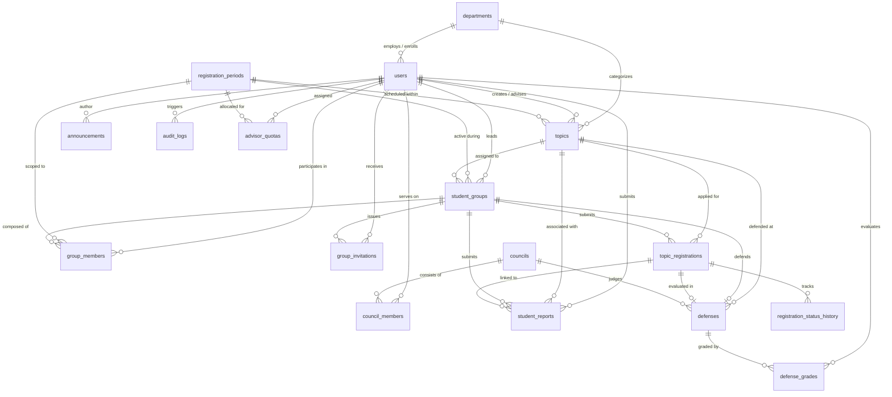

# Database Design: HCM-UTE Student Topic Management System

## 1. Database Architecture & Conventions

The persistence tier is designed for relational consistency, data integrity, and strict academic compliance under **MySQL 8.0+** (InnoDB engine, `utf8mb4_unicode_ci` character set) with full fallback support for **H2** during development and automated testing.

- **Primary Keys**: Auto-incrementing 64-bit integer (`BIGINT AUTO_INCREMENT`).
- **Timestamps**: Microsecond-precision timestamps (`DATETIME(6)`) using UTC/Asia/Ho_Chi_Minh with automatic tracking (`created_at`, `updated_at`).
- **Optimistic Locking**: Handled by numeric `version BIGINT` columns on mutating aggregates (`topics`, `student_groups`, `topic_registrations`, `councils`, `defenses`, `advisor_quotas`).
- **Integrity Enforcement**: Relational foreign keys with cascading or restricting policies, check constraints (`CHECK`), unique compound indexes, and database-level validation.

---

## 2. Entity-Relationship Diagram (ERD)

---

## 3. Database Schema Catalog

### 3.1 `departments`
Stores academic departments within the Faculty of Information Technology.
- `id` (`BIGINT`, PK, Auto-increment)
- `code` (`VARCHAR(50)`, NOT NULL, UNIQUE): e.g., `CNPM`, `HTTT`, `KHDL`, `MMT`.
- `name` (`VARCHAR(255)`, NOT NULL): Department name.
- `description` (`TEXT`, NULL): Optional department summary.

### 3.2 `users`
Central user registry for all faculty members, department heads, deans, and students.
- `id` (`BIGINT`, PK, Auto-increment)
- `user_code` (`VARCHAR(50)`, NOT NULL, UNIQUE): Student ID (MSSV) or Lecturer Code (MSGV).
- `username` (`VARCHAR(100)`, NOT NULL, UNIQUE): Unique login identifier.
- `password_hash` (`VARCHAR(512)`, NOT NULL): BCrypt password hash.
- `full_name` (`VARCHAR(255)`, NOT NULL): User display name.
- `email` (`VARCHAR(255)`, NOT NULL, UNIQUE): Academic email address.
- `role` (`VARCHAR(30)`, NOT NULL): `DEAN`, `HEAD_OF_DEPT`, `LECTURER`, `STUDENT`.
- `department_id` (`BIGINT`, NULL, FK $\rightarrow$ `departments(id)`): Mandatory for faculty members.
- `status` (`VARCHAR(20)`, NOT NULL): `ACTIVE`, `INACTIVE`, `LOCKED`.
- `password_changed_at` (`DATETIME(6)`, NULL): Invalidation timestamp for active HTTP sessions.
- `created_at`, `updated_at` (`DATETIME(6)`): Audit timestamps.

### 3.3 `registration_periods`
Defines time windows and rules for proposal, registration, and defense.
- `id` (`BIGINT`, PK, Auto-increment)
- `name` (`VARCHAR(255)`, NOT NULL): Descriptive period name.
- `type` (`VARCHAR(30)`, NOT NULL): `COURSE`, `NCKH`, `TLCN`, `KLTN`.
- `lecturer_start_at`, `lecturer_end_at` (`DATETIME(6)`, NOT NULL): Lecturer proposal window.
- `student_start_at`, `student_end_at` (`DATETIME(6)`, NOT NULL): Student registration window.
- `review_deadline` (`DATETIME(6)`, NULL): Final deadline for report submissions.
- `defense_date` (`DATE`, NULL): Scheduled defense date.
- **Constraints**:
  - `ck_period_times`: `lecturer_start_at < lecturer_end_at < student_start_at < student_end_at`.
  - `ck_period_review`: Enforces non-null review deadlines and defense dates for `TLCN` and `KLTN`.

### 3.4 `topics`
Project topics proposed by faculty members or deans.
- `id` (`BIGINT`, PK, Auto-increment)
- `version` (`BIGINT`, Optimistic Locking)
- `topic_code` (`VARCHAR(50)`, NOT NULL, UNIQUE): Unique topic code (e.g., `TOPIC-2026-001`).
- `title` (`VARCHAR(255)`, NOT NULL): Topic title.
- `description` (`TEXT`, NOT NULL): Topic description ($\ge 10$ characters).
- `requirements` (`TEXT`, NULL): Prerequisites and technical stack expectations.
- `max_students` (`INT`, NOT NULL, DEFAULT 3): Capacity (1 to 3 students).
- `topic_type` (`VARCHAR(30)`, NOT NULL): Category matching registration period.
- `status` (`VARCHAR(20)`, NOT NULL): `PENDING`, `APPROVED`, `REJECTED`.
- `rejection_reason` (`TEXT`, NULL): Notes from department head upon rejection.
- `department_id` (`BIGINT`, NOT NULL, FK $\rightarrow$ `departments(id)`)
- `period_id` (`BIGINT`, NOT NULL, FK $\rightarrow$ `registration_periods(id)`)
- `created_by` (`BIGINT`, NOT NULL, FK $\rightarrow$ `users(id)`)
- `advisor1_id` (`BIGINT`, NULL, FK $\rightarrow$ `users(id)`): Primary advisor.
- `advisor2_id` (`BIGINT`, NULL, FK $\rightarrow$ `users(id)`): Secondary advisor (optional).
- **Constraints**: `ck_topics_advisors`: `advisor1_id <> advisor2_id`.

### 3.5 `student_groups` & `group_members`
Groups formed by students to execute projects together.
- `student_groups`:
  - `id` (`BIGINT`, PK, Auto-increment)
  - `group_code` (`VARCHAR(50)`, NOT NULL, UNIQUE): e.g., `GRP-K22-001`.
  - `group_name` (`VARCHAR(255)`, NOT NULL)
  - `topic_id` (`BIGINT`, NULL, FK $\rightarrow$ `topics(id)`): Approved topic.
  - `period_id` (`BIGINT`, NULL, FK $\rightarrow$ `registration_periods(id)`): Registration period scope.
  - `leader_id` (`BIGINT`, NOT NULL, FK $\rightarrow$ `users(id)`): Group creator / leader.
  - `member_count` (`INT`, NOT NULL, DEFAULT 1): Enforces 1 to 3 members.
  - `status` (`VARCHAR(20)`, NOT NULL): `DRAFT`, `PENDING`, `APPROVED`, `REJECTED`.
- `group_members`:
  - `id` (`BIGINT`, PK, Auto-increment)
  - `group_id` (`BIGINT`, NOT NULL, FK $\rightarrow$ `student_groups(id)` ON DELETE CASCADE)
  - `student_id` (`BIGINT`, NOT NULL, FK $\rightarrow$ `users(id)`)
  - `registration_period_id` (`BIGINT`, NULL, FK $\rightarrow$ `registration_periods(id)`)
  - `member_role` (`VARCHAR(20)`, NOT NULL): `LEADER`, `MEMBER`.
  - **Constraint**: `uk_group_member_period_student UNIQUE (registration_period_id, student_id)`. Guarantees a student can belong to only one group per period.

### 3.6 `topic_registrations` & `registration_status_history`
Tracks the formal application and review lifecycle of a group for a topic.
- `topic_registrations`:
  - `id` (`BIGINT`, PK, Auto-increment)
  - `group_id` (`BIGINT`, NOT NULL, FK $\rightarrow$ `student_groups(id)` ON DELETE CASCADE)
  - `topic_id` (`BIGINT`, NOT NULL, FK $\rightarrow$ `topics(id)`)
  - `status` (`VARCHAR(20)`, NOT NULL): `DRAFT`, `PENDING`, `APPROVED`, `REJECTED`, `CANCELLED`.
  - `decided_by` (`BIGINT`, NULL, FK $\rightarrow$ `users(id)`): Department Head or Advisor.
  - `reason` (`VARCHAR(2000)`, NULL): Feedback or justification.
- `registration_status_history`:
  - `id` (`BIGINT`, PK, Auto-increment)
  - `registration_id` (`BIGINT`, NOT NULL, FK $\rightarrow$ `topic_registrations(id)` ON DELETE CASCADE)
  - `old_status`, `new_status` (`VARCHAR(20)`, NOT NULL)
  - `changed_by` (`BIGINT`, NOT NULL, FK $\rightarrow$ `users(id)`)
  - `changed_at` (`DATETIME(6)`, NOT NULL)
  - `note` (`VARCHAR(2000)`, NULL)

### 3.7 `student_reports`
Stores progress deliverables submitted by student groups.
- `id` (`BIGINT`, PK, Auto-increment)
- `group_id` (`BIGINT`, NOT NULL, FK $\rightarrow$ `student_groups(id)` ON DELETE CASCADE)
- `registration_id` (`BIGINT`, NULL, FK $\rightarrow$ `topic_registrations(id)` ON DELETE SET NULL)
- `topic_id` (`BIGINT`, NULL, FK $\rightarrow$ `topics(id)` ON DELETE SET NULL)
- `submitted_by_id` (`BIGINT`, NOT NULL, FK $\rightarrow$ `users(id)`)
- `filename` (`VARCHAR(180)`, NOT NULL)
- `content_type` (`VARCHAR(255)`, NOT NULL): `application/pdf`, `application/vnd.openxmlformats-...`
- `stage` (`VARCHAR(255)`, NOT NULL): `Đề cương` (Proposal), `Giữa kỳ` (Midterm), `Cuối kỳ` (Final).
- `content` (`LONGBLOB`, NOT NULL): Binary file content.
- `checksum` (`VARCHAR(64)`, NULL): SHA-256 integrity hash.
- `late` (`BOOLEAN`, NOT NULL, DEFAULT FALSE): Flagged if submitted after deadline.

### 3.8 `councils` & `council_members`
Defense evaluation committees formed by the Dean.
- `councils`:
  - `id` (`BIGINT`, PK, Auto-increment)
  - `code` (`VARCHAR(30)`, NOT NULL, UNIQUE): e.g., `HD-2026-01`.
  - `name` (`VARCHAR(150)`, NOT NULL): Council title.
  - `defense_date` (`DATETIME(6)`, NOT NULL): Defense datetime.
  - `room` (`VARCHAR(80)`, NOT NULL): Physical room or virtual meeting URL.
  - `status` (`VARCHAR(20)`, NOT NULL): `DRAFT`, `READY`, `COMPLETED`.
- `council_members`:
  - `id` (`BIGINT`, PK, Auto-increment)
  - `council_id` (`BIGINT`, NOT NULL, FK $\rightarrow$ `councils(id)` ON DELETE CASCADE)
  - `lecturer_id` (`BIGINT`, NOT NULL, FK $\rightarrow$ `users(id)`)
  - `role` (`VARCHAR(20)`, NOT NULL): `CHAIRPERSON`, `SECRETARY`, `REVIEWER`, `MEMBER`.
  - **Constraint**: `uk_council_lecturer UNIQUE (council_id, lecturer_id)`.

### 3.9 `defenses` & `defense_grades`
Scheduled oral defenses and member grade entries.
- `defenses`:
  - `id` (`BIGINT`, PK, Auto-increment)
  - `group_id` (`BIGINT`, NOT NULL, UNIQUE, FK $\rightarrow$ `student_groups(id)`)
  - `registration_id` (`BIGINT`, NULL, UNIQUE, FK $\rightarrow$ `topic_registrations(id)`)
  - `topic_id` (`BIGINT`, NULL, FK $\rightarrow$ `topics(id)`)
  - `council_id` (`BIGINT`, NOT NULL, FK $\rightarrow$ `councils(id)`)
  - `reviewer_id` (`BIGINT`, NOT NULL, FK $\rightarrow$ `users(id)`): Assigned reviewer (`GVPB`).
  - `finalized` (`BOOLEAN`, NOT NULL, DEFAULT FALSE): Set true when Chairperson synthesizes scores.
  - `published` (`BOOLEAN`, NOT NULL, DEFAULT FALSE): Set true when Dean officially publishes results.
  - `final_score` (`DECIMAL(4,2)`, NULL): Weighted arithmetic average ($0.00$ to $10.00$).
- `defense_grades`:
  - `id` (`BIGINT`, PK, Auto-increment)
  - `defense_id` (`BIGINT`, NOT NULL, FK $\rightarrow$ `defenses(id)` ON DELETE CASCADE)
  - `evaluator_id` (`BIGINT`, NOT NULL, FK $\rightarrow$ `users(id)`)
  - `score` (`DECIMAL(4,2)`, NOT NULL): Member score ($0.00$ to $10.00$).
  - `comment` (`VARCHAR(2000)`, NOT NULL): Qualitative feedback.
  - **Constraint**: `uk_defense_evaluator UNIQUE (defense_id, evaluator_id)`.

---

## 4. Flyway Database Migrations

The database lifecycle is managed via Flyway migration scripts in `database/migration/`:

| Version | Migration Script | Description |
| :--- | :--- | :--- |
| `V2` | `V2__add_topic_registration.sql` | Establishes the decoupled `topic_registrations` model and audit logs. |
| `V3` | `V3__add_registration_history.sql` | Introduces `registration_status_history` for full transition tracking. |
| `V4` | `V4__add_quota_audit_report_metadata.sql` | Adds advisor quotas, file checksums, storage paths, and report metadata. |
| `V5` | `V5__fix_constraints_and_linkages.sql` | Adds `password_changed_at`, period-scoped group memberships (`uk_group_member_period_student`), and explicit `registration_id` and `topic_id` linkages on `student_reports` and `defenses`. |
