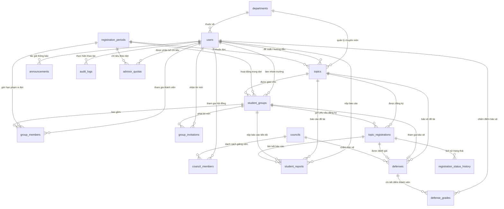

# Thiết kế Cơ sở dữ liệu: Hệ thống Quản lý Đề tài Sinh viên HCM-UTE

## 1. Kiến trúc lưu trữ & Quy ước thiết kế

Tầng lưu trữ dữ liệu của hệ thống được thiết kế hướng tới tính toàn vẹn, tính nhất quán quan hệ và khả năng mở rộng cao trên hệ quản trị **MySQL Server 8.0+** (sử dụng Storage Engine InnoDB, bảng mã ký tự `utf8mb4` và collation `utf8mb4_unicode_ci`), đồng thời tương thích hoàn toàn với **H2 Database** phục vụ môi trường kiểm thử tự động và demo cục bộ.

- **Khóa chính (Primary Keys)**: Số nguyên 64-bit tự tăng (`BIGINT AUTO_INCREMENT`).
- **Mốc thời gian (Timestamps)**: Sử dụng kiểu `DATETIME(6)` với độ chính xác microsecond, múi giờ Việt Nam (`Asia/Ho_Chi_Minh`), tự động ghi nhận thời điểm tạo (`created_at`) và thời điểm cập nhật (`updated_at`).
- **Khóa lạc quan (Optimistic Locking)**: Cột `version BIGINT` trên các bảng có tần suất cập nhật cao (`topics`, `student_groups`, `topic_registrations`, `councils`, `defenses`, `advisor_quotas`) nhằm chống ghi đè dữ liệu khi có tương tác đồng thời.
- **Ràng buộc toàn vẹn**: Thực thi khóa ngoại (Foreign Keys) với chính sách xóa phù hợp (`ON DELETE CASCADE` hoặc `ON DELETE SET NULL`), các ràng buộc kiểm tra giá trị (`CHECK constraints`), và chỉ mục duy nhất kết hợp (`UNIQUE compound indexes`).

---

## 2. Sơ đồ Quan hệ Thực thể (Entity-Relationship Diagram - ERD)

---

## 3. Danh mục chi tiết các bảng dữ liệu

### 3.1 `departments` (Bộ môn chuyên ngành)
Lưu trữ danh sách các Bộ môn trực thuộc Khoa Công nghệ Thông tin.
- `id` (`BIGINT`, PK, Auto-increment)
- `code` (`VARCHAR(50)`, NOT NULL, UNIQUE): Mã bộ môn (ví dụ: `CNPM`, `HTTT`, `KHDL`, `MMT`).
- `name` (`VARCHAR(255)`, NOT NULL): Tên đầy đủ của bộ môn.
- `description` (`TEXT`, NULL): Mô tả chuyên ngành hoặc chức năng của bộ môn.

### 3.2 `users` (Người dùng hệ thống)
Lưu trữ tài khoản của toàn bộ cán bộ, giảng viên và sinh viên.
- `id` (`BIGINT`, PK, Auto-increment)
- `user_code` (`VARCHAR(50)`, NOT NULL, UNIQUE): Mã số sinh viên (MSSV) hoặc Mã số giảng viên (MSGV).
- `username` (`VARCHAR(100)`, NOT NULL, UNIQUE): Tên đăng nhập duy nhất.
- `password_hash` (`VARCHAR(512)`, NOT NULL): Mật khẩu đã băm bằng giải thuật BCrypt.
- `full_name` (`VARCHAR(255)`, NOT NULL): Họ và tên đầy đủ của người dùng.
- `email` (`VARCHAR(255)`, NOT NULL, UNIQUE): Địa chỉ email phục vụ thông báo và tài khoản.
- `role` (`VARCHAR(30)`, NOT NULL): Vai trò hệ thống (`DEAN`, `HEAD_OF_DEPT`, `LECTURER`, `STUDENT`).
- `department_id` (`BIGINT`, NULL, FK $\rightarrow$ `departments(id)`): Bắt buộc đối với giảng viên và trưởng bộ môn.
- `status` (`VARCHAR(20)`, NOT NULL): Trạng thái tài khoản (`ACTIVE`, `INACTIVE`, `LOCKED`).
- `password_changed_at` (`DATETIME(6)`, NULL): Mốc thời gian đổi mật khẩu gần nhất để hủy phiên đăng nhập cũ.
- `created_at`, `updated_at` (`DATETIME(6)`): Thời điểm khởi tạo và cập nhật gần nhất.

### 3.3 `registration_periods` (Đợt đăng ký đề tài)
Quản lý các đợt đăng ký và các mốc thời hạn theo quy chế đào tạo.
- `id` (`BIGINT`, PK, Auto-increment)
- `name` (`VARCHAR(255)`, NOT NULL): Tên đợt đăng ký.
- `type` (`VARCHAR(30)`, NOT NULL): Loại đợt (`COURSE`, `NCKH`, `TLCN`, `KLTN`).
- `lecturer_start_at`, `lecturer_end_at` (`DATETIME(6)`, NOT NULL): Cửa sổ thời gian giảng viên đề xuất đề tài.
- `student_start_at`, `student_end_at` (`DATETIME(6)`, NOT NULL): Cửa sổ thời gian sinh viên đăng ký đề tài.
- `review_deadline` (`DATETIME(6)`, NULL): Hạn chót nộp báo cáo và phản biện.
- `defense_date` (`DATE`, NULL): Ngày tổ chức hội đồng bảo vệ.
- **Ràng buộc kiểm tra**:
  - `ck_period_times`: `lecturer_start_at < lecturer_end_at < student_start_at < student_end_at`.
  - `ck_period_review`: Bắt buộc có hạn nộp và ngày bảo vệ đối với `TLCN` và `KLTN`.

### 3.4 `topics` (Đề tài học thuật)
Lưu trữ danh sách các đề tài do giảng viên hoặc trưởng khoa đề xuất.
- `id` (`BIGINT`, PK, Auto-increment)
- `version` (`BIGINT`, Khóa lạc quan)
- `topic_code` (`VARCHAR(50)`, NOT NULL, UNIQUE): Mã đề tài (ví dụ: `TOPIC-2026-001`).
- `title` (`VARCHAR(255)`, NOT NULL): Tên đề tài.
- `description` (`TEXT`, NOT NULL): Mô tả chi tiết mục tiêu đề tài ($\ge 10$ ký tự).
- `requirements` (`TEXT`, NULL): Yêu cầu kiến thức và kỹ năng đối với sinh viên.
- `max_students` (`INT`, NOT NULL, DEFAULT 3): Số lượng sinh viên tối đa cho phép (1 đến 3).
- `topic_type` (`VARCHAR(30)`, NOT NULL): Loại hình đề tài tương ứng với đợt đăng ký.
- `status` (`VARCHAR(20)`, NOT NULL): Trạng thái phê duyệt (`PENDING`, `APPROVED`, `REJECTED`).
- `rejection_reason` (`TEXT`, NULL): Lý do từ chối của trưởng bộ môn (nếu có).
- `department_id` (`BIGINT`, NOT NULL, FK $\rightarrow$ `departments(id)`)
- `period_id` (`BIGINT`, NOT NULL, FK $\rightarrow$ `registration_periods(id)`)
- `created_by` (`BIGINT`, NOT NULL, FK $\rightarrow$ `users(id)`)
- `advisor1_id` (`BIGINT`, NULL, FK $\rightarrow$ `users(id)`): Giảng viên hướng dẫn chính.
- `advisor2_id` (`BIGINT`, NULL, FK $\rightarrow$ `users(id)`): Giảng viên hướng dẫn phụ.
- **Ràng buộc**: `ck_topics_advisors`: `advisor1_id <> advisor2_id`.

### 3.5 `student_groups` & `group_members` (Nhóm sinh viên & Thành viên)
- **`student_groups`**:
  - `id` (`BIGINT`, PK, Auto-increment)
  - `group_code` (`VARCHAR(50)`, NOT NULL, UNIQUE): Mã nhóm duy nhất (ví dụ: `GRP-202601`).
  - `group_name` (`VARCHAR(255)`, NOT NULL): Tên gọi của nhóm.
  - `topic_id` (`BIGINT`, NULL, FK $\rightarrow$ `topics(id)`): Đề tài đã được giao chính thức.
  - `period_id` (`BIGINT`, NULL, FK $\rightarrow$ `registration_periods(id)`): Đợt đăng ký của nhóm.
  - `leader_id` (`BIGINT`, NOT NULL, FK $\rightarrow$ `users(id)`): Người tạo nhóm (Nhóm trưởng).
  - `member_count` (`INT`, NOT NULL, DEFAULT 1): Số lượng thành viên (1 đến 3).
  - `status` (`VARCHAR(20)`, NOT NULL): Trạng thái (`DRAFT`, `PENDING`, `APPROVED`, `REJECTED`).
- **`group_members`**:
  - `id` (`BIGINT`, PK, Auto-increment)
  - `group_id` (`BIGINT`, NOT NULL, FK $\rightarrow$ `student_groups(id)` ON DELETE CASCADE)
  - `student_id` (`BIGINT`, NOT NULL, FK $\rightarrow$ `users(id)`)
  - `registration_period_id` (`BIGINT`, NULL, FK $\rightarrow$ `registration_periods(id)`)
  - `member_role` (`VARCHAR(20)`, NOT NULL): Vai trò trong nhóm (`LEADER`, `MEMBER`).
  - **Ràng buộc then chốt**: `uk_group_member_period_student UNIQUE (registration_period_id, student_id)`. Bảo đảm một sinh viên chỉ có thể tham gia đúng 1 nhóm trong một đợt đăng ký cụ thể.

### 3.6 `topic_registrations` & `registration_status_history` (Đăng ký đề tài & Lịch sử)
- **`topic_registrations`**:
  - `id` (`BIGINT`, PK, Auto-increment)
  - `group_id` (`BIGINT`, NOT NULL, FK $\rightarrow$ `student_groups(id)` ON DELETE CASCADE)
  - `topic_id` (`BIGINT`, NOT NULL, FK $\rightarrow$ `topics(id)`)
  - `status` (`VARCHAR(20)`, NOT NULL): Trạng thái đăng ký (`DRAFT`, `PENDING`, `APPROVED`, `REJECTED`, `CANCELLED`).
  - `decided_by` (`BIGINT`, NULL, FK $\rightarrow$ `users(id)`): Người phê duyệt đăng ký.
  - `reason` (`VARCHAR(2000)`, NULL): Lý do phê duyệt hoặc từ chối.
- **`registration_status_history`**:
  - `id` (`BIGINT`, PK, Auto-increment)
  - `registration_id` (`BIGINT`, NOT NULL, FK $\rightarrow$ `topic_registrations(id)` ON DELETE CASCADE)
  - `old_status`, `new_status` (`VARCHAR(20)`, NOT NULL)
  - `changed_by` (`BIGINT`, NOT NULL, FK $\rightarrow$ `users(id)`)
  - `changed_at` (`DATETIME(6)`, NOT NULL)
  - `note` (`VARCHAR(2000)`, NULL)

### 3.7 `student_reports` (Báo cáo tiến độ)
Lưu trữ tệp tài liệu và báo cáo do nhóm sinh viên nộp qua các giai đoạn.
- `id` (`BIGINT`, PK, Auto-increment)
- `group_id` (`BIGINT`, NOT NULL, FK $\rightarrow$ `student_groups(id)` ON DELETE CASCADE)
- `registration_id` (`BIGINT`, NULL, FK $\rightarrow$ `topic_registrations(id)` ON DELETE SET NULL)
- `topic_id` (`BIGINT`, NULL, FK $\rightarrow$ `topics(id)` ON DELETE SET NULL)
- `submitted_by_id` (`BIGINT`, NOT NULL, FK $\rightarrow$ `users(id)`): Nhóm trưởng nộp bài.
- `filename` (`VARCHAR(180)`, NOT NULL): Tên tệp gốc.
- `content_type` (`VARCHAR(255)`, NOT NULL): Định dạng MIME (`application/pdf`, `.docx`).
- `stage` (`VARCHAR(255)`, NOT NULL): Giai đoạn báo cáo (`Đề cương`, `Giữa kỳ`, `Cuối kỳ`).
- `content` (`LONGBLOB`, NOT NULL): Nội dung nhị phân của tệp báo cáo.
- `checksum` (`VARCHAR(64)`, NULL): Chuỗi mã băm SHA-256 đối soát toàn vẹn dữ liệu.
- `late` (`BOOLEAN`, NOT NULL, DEFAULT FALSE): Đánh dấu nộp trễ nếu sau hạn chót.

### 3.8 `councils` & `council_members` (Hội đồng bảo vệ & Thành viên)
- **`councils`**:
  - `id` (`BIGINT`, PK, Auto-increment)
  - `code` (`VARCHAR(30)`, NOT NULL, UNIQUE): Mã hội đồng (ví dụ: `HD-CNTT-01`).
  - `name` (`VARCHAR(150)`, NOT NULL): Tên gọi của hội đồng.
  - `defense_date` (`DATETIME(6)`, NOT NULL): Thời gian tổ chức buổi bảo vệ.
  - `room` (`VARCHAR(80)`, NOT NULL): Phòng bảo vệ trực tiếp hoặc đường dẫn trực tuyến.
  - `status` (`VARCHAR(20)`, NOT NULL): Trạng thái (`DRAFT`, `READY`, `COMPLETED`).
- **`council_members`**:
  - `id` (`BIGINT`, PK, Auto-increment)
  - `council_id` (`BIGINT`, NOT NULL, FK $\rightarrow$ `councils(id)` ON DELETE CASCADE)
  - `lecturer_id` (`BIGINT`, NOT NULL, FK $\rightarrow$ `users(id)`)
  - `role` (`VARCHAR(20)`, NOT NULL): Vai trò (`CHAIRPERSON`, `SECRETARY`, `REVIEWER`, `MEMBER`).
  - **Ràng buộc**: `uk_council_lecturer UNIQUE (council_id, lecturer_id)`.

### 3.9 `defenses` & `defense_grades` (Lịch bảo vệ & Chi tiết chấm điểm)
- **`defenses`**:
  - `id` (`BIGINT`, PK, Auto-increment)
  - `group_id` (`BIGINT`, NOT NULL, UNIQUE, FK $\rightarrow$ `student_groups(id)`)
  - `registration_id` (`BIGINT`, NULL, UNIQUE, FK $\rightarrow$ `topic_registrations(id)`)
  - `topic_id` (`BIGINT`, NULL, FK $\rightarrow$ `topics(id)`)
  - `council_id` (`BIGINT`, NOT NULL, FK $\rightarrow$ `councils(id)`)
  - `reviewer_id` (`BIGINT`, NOT NULL, FK $\rightarrow$ `users(id)`): Giảng viên phản biện chỉ định (`GVPB`).
  - `finalized` (`BOOLEAN`, NOT NULL, DEFAULT FALSE): Đã tổng hợp điểm xong bởi Chủ tịch.
  - `published` (`BOOLEAN`, NOT NULL, DEFAULT FALSE): Đã công bố kết quả bởi Trưởng khoa.
  - `final_score` (`DECIMAL(4,2)`, NULL): Điểm trung bình cộng cuối cùng (thang điểm 0.00 đến 10.00).
- **`defense_grades`**:
  - `id` (`BIGINT`, PK, Auto-increment)
  - `defense_id` (`BIGINT`, NOT NULL, FK $\rightarrow$ `defenses(id)` ON DELETE CASCADE)
  - `evaluator_id` (`BIGINT`, NOT NULL, FK $\rightarrow$ `users(id)`): Giảng viên chấm điểm.
  - `score` (`DECIMAL(4,2)`, NOT NULL): Điểm số đánh giá cá nhân (0.00 đến 10.00).
  - `comment` (`VARCHAR(2000)`, NOT NULL): Nhận xét chuyên môn.
  - **Ràng buộc**: `uk_defense_evaluator UNIQUE (defense_id, evaluator_id)`.

---

## 4. Quản lý tiến hóa Schema qua Flyway Migrations

Các phiên bản nâng cấp cấu trúc cơ sở dữ liệu được quản lý tự động tại thư mục `database/migration/`:

| Phiên bản | Tệp script Migration | Mô tả thay đổi kiến trúc |
| :--- | :--- | :--- |
| `V2` | `V2__add_topic_registration.sql` | Phân tách mô hình `topic_registrations` độc lập và thêm bảng `audit_logs`. |
| `V3` | `V3__add_registration_history.sql` | Bổ sung bảng `registration_status_history` ghi vết toàn diện chuyển đổi trạng thái. |
| `V4` | `V4__add_quota_audit_report_metadata.sql` | Bổ sung bảng chỉ tiêu hướng dẫn `advisor_quotas` và metadata toàn vẹn tệp báo cáo. |
| `V5` | `V5__fix_constraints_and_linkages.sql` | Bổ sung cột `password_changed_at`, ràng buộc thành viên nhóm theo đợt (`uk_group_member_period_student`), và liên kết trực tiếp `registration_id`, `topic_id` vào `student_reports` và `defenses`. |
