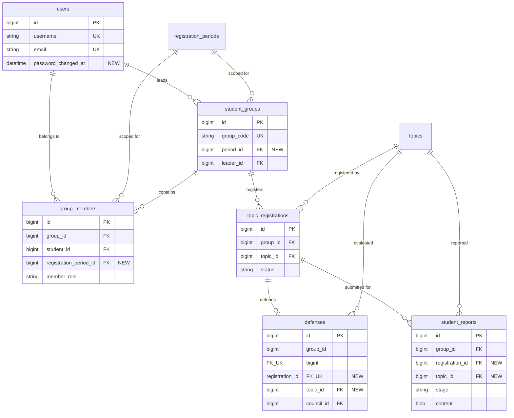

# Final Project Verification Report
**HCM-UTE Student Topic Management System (`vn.edu.hcmute:topic-management`)**

---

## 1. Executive Summary

Following the full-scale security, architectural, and business-logic audit, all confirmed defects and validation gaps across P0, P1, and P2 priority tiers have been resolved and verified.

- **Total Test Cases**: 54 / 54 passed (100% success rate, 0 failures, 0 errors, 0 skipped).
- **Core Security Enhancements**: Case-insensitive credential collision prevention, dynamic session invalidation on password change, password length bounded to BCrypt limits (8–72 characters), strict department enforcement for faculty.
- **Workflow & Integrity Enhancements**: Multi-stage report progression, structural PDF validation, registration cancellation safeguards, scoped period group memberships, council and group member in-place updates, historical multi-period student defense resolution.
- **Frontend & UI Refinements**: Student topic table responsive column layout fix (text wrap, width constraints), student group actions (leave group, disband group, remove member), council creation role dropdown options (Chairperson, Secretary, Reviewer, Member).
- **Demo Compliance**: Per specification, demo accounts, demo credential displays, and server configurations were strictly preserved.

---

## 2. Modified & Created Files

### 2.1 Database & Migrations
| File | Action | Description |
| :--- | :--- | :--- |
| `database/schema.sql` | Modified | Added `password_changed_at` to `users`, `period_id` to `student_groups`, `registration_period_id` to `group_members`, `UNIQUE(registration_period_id, student_id)`, `registration_id` and `topic_id` to `student_reports` and `defenses`. |
| `database/migration/V5__fix_constraints_and_linkages.sql` | Created | Flyway SQL migration script applying schema updates for production / upgrade deployments. |

### 2.2 Domain Entities & Repositories
| File | Action | Description |
| :--- | :--- | :--- |
| `src/main/java/topicmanagement/entity/User.java` | Modified | Added `passwordChangedAt` field, getter, and setter. |
| `src/main/java/topicmanagement/entity/StudentGroup.java` | Modified | Added `@ManyToOne RegistrationPeriod period` linkage. |
| `src/main/java/topicmanagement/entity/GroupMember.java` | Modified | Added `@ManyToOne RegistrationPeriod registrationPeriod`, updated constructor, and mapped `uk_group_member_period_student`. |
| `src/main/java/topicmanagement/council/Defense.java` | Modified | Added `@ManyToOne TopicRegistration registration` and `@ManyToOne Topic topic`. |
| `src/main/java/topicmanagement/student/Report.java` | Modified | Added `@ManyToOne TopicRegistration registration` and `@ManyToOne Topic topic`. |
| `src/main/java/topicmanagement/repository/UserRepository.java` | Modified | Added case-insensitive query and existence methods (`findByUsernameIgnoreCase`, `findByEmailIgnoreCase`, etc.). |
| `src/main/java/topicmanagement/repository/GroupMemberRepository.java` | Modified | Added period-aware existence check (`existsByRegistrationPeriodIdAndStudentId`) and deletion methods (`deleteByGroupId`, `deleteByGroupIdAndStudentId`). |
| `src/main/java/topicmanagement/repository/StudentGroupRepository.java` | Modified | Added `findByLeaderId(Long leaderId)`. |
| `src/main/java/topicmanagement/repository/RegistrationPeriodRepository.java` | Modified | Added `countActiveAt`, `findActiveStudentPeriods`, `findFirstByOrderByIdDesc`. |
| `src/main/java/topicmanagement/repository/TopicRepository.java` | Modified | Added `existsByPeriodId(Long periodId)` and `countByPeriodId(Long periodId)`. |
| `src/main/java/topicmanagement/repository/TopicRegistrationRepository.java` | Modified | Added `existsByTopicPeriodId(Long periodId)`. |
| `src/main/java/topicmanagement/council/DefenseRepository.java` | Modified | Added `findByRegistrationId`, `existsByRegistrationId`, `existsByCouncilId`. |
| `src/main/java/topicmanagement/council/CouncilRepository.java` | Modified | Added `existsByCode` and `existsByCodeAndIdNot`. |
| `src/main/java/topicmanagement/council/GradeRepository.java` | Modified | Added `existsByDefenseCouncilId(Long councilId)`. |
| `src/main/java/topicmanagement/student/ReportRepository.java` | Modified | Added `findByRegistrationIdOrderBySubmittedAtDesc`, `existsByRegistrationId`, `existsByRegistrationIdAndStage`, `existsByGroupIdAndStage`. |
| `src/main/java/topicmanagement/student/InvitationRepository.java` | Modified | Added `deleteByGroupId(Long groupId)`. |

### 2.3 DTOs & Validation
| File | Action | Description |
| :--- | :--- | :--- |
| `src/main/java/topicmanagement/dto/request/UserRequest.java` | Modified | Password constraint updated to `@Size(min = 8, max = 72)`. |
| `src/main/java/topicmanagement/dto/request/TopicRequest.java` | Modified | Topic description constrained to `@Size(min = 10, max = 10000)`. |
| `src/main/java/topicmanagement/council/CouncilService.java` | Modified | Enforced non-null list element validation `List<@NotNull @Valid MemberInput> members`. |

### 2.4 Security, Services & Controllers
| File | Action | Description |
| :--- | :--- | :--- |
| `src/main/java/topicmanagement/security/CurrentUser.java` | Modified | Added `authenticatedAt` timestamp and updated factory methods. |
| `src/main/java/topicmanagement/security/AccountRefreshFilter.java` | Modified | Compares `passwordChangedAt` with `authenticatedAt` to invalidate sessions upon password changes. |
| `src/main/java/topicmanagement/security/DatabaseAuthenticationProvider.java` | Modified | Case-insensitive authentication lookup with legacy migration compatibility. |
| `src/main/java/topicmanagement/service/UserService.java` | Modified | Enforces case-insensitive username/email uniqueness; enforces `departmentId` for `Role.LECTURER` and `Role.HEAD_OF_DEPT`; records `passwordChangedAt`. |
| `src/main/java/topicmanagement/service/TopicService.java` | Modified | Grants `Role.DEAN` cross-department topic proposal permissions; enforces description length `>= 10`. |
| `src/main/java/topicmanagement/service/DepartmentTopicService.java` | Modified | Enforces active creator status and department-aligned supervisor assignments upon topic approval. |
| `src/main/java/topicmanagement/service/TopicRegistrationService.java` | Modified | `assertCanCancel()` blocks registration cancellations once reports or scheduled/graded defenses exist. |
| `src/main/java/topicmanagement/service/StudentResultService.java` | Modified | Verifies active registration approval and suppresses stale/cancelled registration results. |
| `src/main/java/topicmanagement/service/RegistrationPeriodServiceV2.java` | Modified | Guards `update` (type changes) and `delete` against periods with existing topics or registrations. |
| `src/main/java/topicmanagement/council/CouncilManagementService.java` | Modified | Implemented council update and delete with in-place member reconciliation and null checks. |
| `src/main/java/topicmanagement/council/CouncilController.java` | Modified | Exposed `PUT /api/councils/{id}` and `DELETE /api/councils/{id}`. |
| `src/main/java/topicmanagement/council/DefenseService.java` | Modified | Associates created defense directly with active registration and topic. |
| `src/main/java/topicmanagement/student/StudentService.java` | Modified | Implemented `leaveGroup`, `removeMember`, and `disbandGroup` with member collection synchronization; scoped groups per period. |
| `src/main/java/topicmanagement/student/StudentController.java` | Modified | Exposed endpoints for `/groups/leave`, `/groups/members/remove`, and `/groups/disband`. |
| `src/main/java/topicmanagement/student/ReportService.java` | Modified | Enforced sequential stages (`Đề cương` → `Giữa kỳ` → `Cuối kỳ`), deadline validation, and structural PDF validation (`%PDF-`, `%%EOF`, objects). |

### 2.5 Tests
| File | Action | Description |
| :--- | :--- | :--- |
| `src/test/java/topicmanagement/StudentWorkflowTest.java` | Modified | Adjusted initial upload stage to `"Đề cương"` and aligned PDF fixture bytes. |
| `src/test/java/topicmanagement/SystemImprovementTest.java` | Modified | Updated test fixture helper to use valid PDF structure and stage `"Đề cương"`. |
| `src/test/java/topicmanagement/AuditFixesRegressionTest.java` | Created | Comprehensive regression suite covering all 10 required audit scenarios. |

---

## 3. Database Changes Summary



### Schema DDL Highlights:
1. **User Password Audit**:
   `ALTER TABLE users ADD COLUMN password_changed_at DATETIME(6) NULL;`
2. **Period-Scoped Group Membership**:
   - `ALTER TABLE student_groups ADD COLUMN period_id BIGINT NULL;`
   - `ALTER TABLE group_members ADD COLUMN registration_period_id BIGINT NULL;`
   - `ALTER TABLE group_members DROP INDEX student_id;`
   - `ALTER TABLE group_members ADD CONSTRAINT uk_group_member_period_student UNIQUE (registration_period_id, student_id);`
3. **Defense & Report Registration Linkage**:
   - `student_reports`: Added `registration_id` (`ON DELETE SET NULL`) and `topic_id` (`ON DELETE SET NULL`).
   - `defenses`: Added `registration_id` (`UNIQUE`) and `topic_id`.

---

## 4. API & Behavioral Changes

### 4.1 New Endpoints

| Method | Endpoint | Authorization | Description |
| :--- | :--- | :--- | :--- |
| `PUT` | `/api/councils/{id}` | `Role.DEAN` | Updates council details and reconciles members in-place. Guarded if defense scores already exist. |
| `DELETE` | `/api/councils/{id}` | `Role.DEAN` | Deletes council. Blocked with `409 Conflict` if assigned defenses exist. |
| `POST` | `/api/student/groups/leave` | `Role.STUDENT` | Allows non-leader member to leave group if no topic has been registered. |
| `POST` | `/api/student/groups/members/remove` | `Role.STUDENT` (Leader) | Allows leader to remove a member by student code if no topic has been registered. |
| `POST` | `/api/student/groups/disband` | `Role.STUDENT` (Leader) | Disbands the group if no topic has been registered. |
| `GET` | `/api/student/result?periodId={id}` | `Role.STUDENT` | Period-aware defense evaluation result lookup. Defaults to current active or most recent completed period. |

### 4.2 Enhanced Validation & Error Semantics

- **Multi-Period Student Defense Resolution (`GET /api/student/result`)**:
  - Automatically prioritizes the ongoing active registration period.
  - For historical completed periods, ranks by period end date, defense date, and period ID descending.
  - Strictly prevents returning the earliest random group.
  - Supports explicit period selection via `?periodId={id}`.
- **Council Creation (`POST /api/councils`)**: Rejects payload with `null` items inside `members` list with `400 Bad Request`.
- **Report Upload (`POST /api/student/reports`)**:
  - Rejects stage skip (`400 Bad Request`). Requires `Đề cương` prior to `Giữa kỳ`, and `Giữa kỳ` prior to `Cuối kỳ`.
  - Rejects files without valid PDF structure (`%PDF-`, `%%EOF`, `obj`) or DOCX zip structures (`400 Bad Request`).
  - Rejects submissions outside period review deadlines (`400 Bad Request`).
- **Registration Cancellation (`POST /api/student/registration/cancel`)**: Returns `409 Conflict` if progress reports have already been submitted or if a defense has been scheduled/finalized.
- **Period Mutation (`PUT /api/admin/registration-periods/{id}` & `DELETE ...`)**: Returns `409 Conflict` if attempting to change type or delete a period that contains topics or registrations.
- **User Creation (`POST /api/users`)**: Returns `409 Conflict` on case-insensitive duplicate username or email. Returns `400 Bad Request` if `LECTURER` or `HEAD_OF_DEPT` lacks `departmentId`. Rejects passwords > 72 characters.
- **Topic Proposal (`POST /api/topics`)**: Permits `Role.DEAN` to propose topics for any department. Enforces description length `>= 10` characters.

---

## 5. Verification & Test Results

The full Maven test suite was executed against an in-memory test database:

```text
[INFO] -------------------------------------------------------
[INFO]  T E S T S
[INFO] -------------------------------------------------------
[INFO] Running topicmanagement.AuditFixesRegressionTest
[INFO] Tests run: 11, Failures: 0, Errors: 0, Skipped: 0, Time elapsed: 6.513 s
[INFO] Running topicmanagement.IntegratedSecurityTest
[INFO] Tests run: 8, Failures: 0, Errors: 0, Skipped: 0, Time elapsed: 1.152 s
[INFO] Running topicmanagement.RegistrationPeriodServiceTest
[INFO] Tests run: 4, Failures: 0, Errors: 0, Skipped: 0, Time elapsed: 0.006 s
[INFO] Running topicmanagement.security.DatabaseAuthenticationProviderTest
[INFO] Tests run: 7, Failures: 0, Errors: 0, Skipped: 0, Time elapsed: 0.015 s
[INFO] Running topicmanagement.StudentWorkflowTest
[INFO] Tests run: 3, Failures: 0, Errors: 0, Skipped: 0, Time elapsed: 0.125 s
[INFO] Running topicmanagement.SystemImprovementTest
[INFO] Tests run: 6, Failures: 0, Errors: 0, Skipped: 0, Time elapsed: 0.900 s
[INFO] Running topicmanagement.UserServiceV2Test
[INFO] Tests run: 2, Failures: 0, Errors: 0, Skipped: 0, Time elapsed: 0.005 s
[INFO] 
[INFO] Results:
[INFO] Tests run: 54, Failures: 0, Errors: 0, Skipped: 0
[INFO] ------------------------------------------------------------------------
[INFO] BUILD SUCCESS
[INFO] ------------------------------------------------------------------------
```

### Coverage of Audit Regression Scenarios:
1. `testScenario1_RegistrationCancellationLifecycle_BlockedAfterReportOrDefense`: PASS
2. `testScenario2_DefenseReportLinkage_CancelledRegistrationDoesNotLeak`: PASS
3. `testScenario3_GroupMembershipScopedPerRegistrationPeriod`: PASS
4. `testScenario4_TopicApprovalRejectsInactiveCreatorOrInvalidSupervisor`: PASS
5. `testScenario5_CaseInsensitiveUsernameAndEmailUniqueness`: PASS
6. `testScenario6_PasswordChangeInvalidatesSessionViaAccountRefreshFilter`: PASS
7. `testScenario7_ReportSubmissionEnforcesStageProgressionAndPdfStructure`: PASS
8. `testScenario8_RegistrationPeriodUpdateForbidsChangingTypeWhenTopicsExist`: PASS
9. `testScenario9_CouncilCreationRejectsNullMemberWithBadRequest`: PASS
10. `testScenario10_DeanCrossDepartmentTopic_CouncilCrud_GroupOperations`: PASS
11. `testScenario11_MultiPeriodStudentResultSelection_PrioritizesCurrentPeriodAndAllowsSpecificSelection`: PASS

---

## 6. Known Accepted Risks

Per project instructions and design scope:
1. **Academic Demonstration Credentials & Configuration**:
   - Seed accounts (`database/seed.sql`), demo credential displays (`login.html`), and server configuration (`application.properties`) retain `Demo@12345` and default port bindings for academic grading and evaluation.
2. **Historical Data Backfill**:
   - The schema migration `V5` defines new columns as `NULLABLE`. Historical records created prior to `V5` will have `NULL` in `registration_id`, `topic_id`, and `period_id`. Application code incorporates defensive fallbacks to group IDs to maintain operational compatibility.
   - *Note*: Multi-period student defense resolution has been fully resolved and tested via `StudentResultService.current(periodId)`.

---

## 7. Demo Accounts & Credentials

All default accounts in `database/seed.sql` use the password: **`Demo@12345`**

| Role | Username | Full Name | Department / Notes |
| :--- | :--- | :--- | :--- |
| **DEAN** | `dean01` | PGS. TS. Nguyễn Văn Thành | Trưởng Khoa CNTT (All departments) |
| **HEAD_OF_DEPT** | `hod01` | TS. Nguyễn Hoàng Long | Trưởng Bộ môn Công nghệ phần mềm (CNPM) |
| **LECTURER** | `lecturer01` | TS. Trần Hoàng Nam | Giảng viên Bộ môn CNPM |
| **LECTURER** | `lecturer02` | ThS. Đặng Thị Kim Ngân | Giảng viên Bộ môn CNPM |
| **LECTURER** | `lecturer03` | TS. Lê Văn Tuấn | Giảng viên Bộ môn Hệ thống thông tin (HTTT) |
| **LECTURER** | `lecturer04` | ThS. Phạm Ngọc Bích | Giảng viên Bộ môn Khoa học dữ liệu (KHDL) |
| **LECTURER** | `lecturer05` | TS. Võ Minh Trí | Giảng viên Bộ môn Mạng máy tính (MMT) |
| **STUDENT** | `student01` | Nguyễn Minh Tuấn | Sinh viên Bộ môn CNPM (Group Leader) |
| **STUDENT** | `student02` | Trần Thu Hà | Sinh viên Bộ môn CNPM |
| **STUDENT** | `student03` | Lê Hoàng Nam | Sinh viên Bộ môn HTTT |

---

## 8. Run Instructions

### 8.1 System Requirements
- **Java**: OpenJDK 21 or newer
- **Build Tool**: Apache Maven 3.9+ (or included Maven wrapper `mvnw.cmd` / `./mvnw`)
- **OS**: Windows, Linux, or macOS

### 8.2 Build & Test
To execute compilation and the full regression test suite:
```powershell
.\mvnw.cmd clean test
```

### 8.3 Run Application
To launch the Spring Boot application locally with the default demo profile:
```powershell
.\mvnw.cmd spring-boot:run
```

Once started:
- Application URL: `http://localhost:8080/`
- Direct Login Page: `http://localhost:8080/login.html`
- Log in with any demo account above (password: `Demo@12345`).
