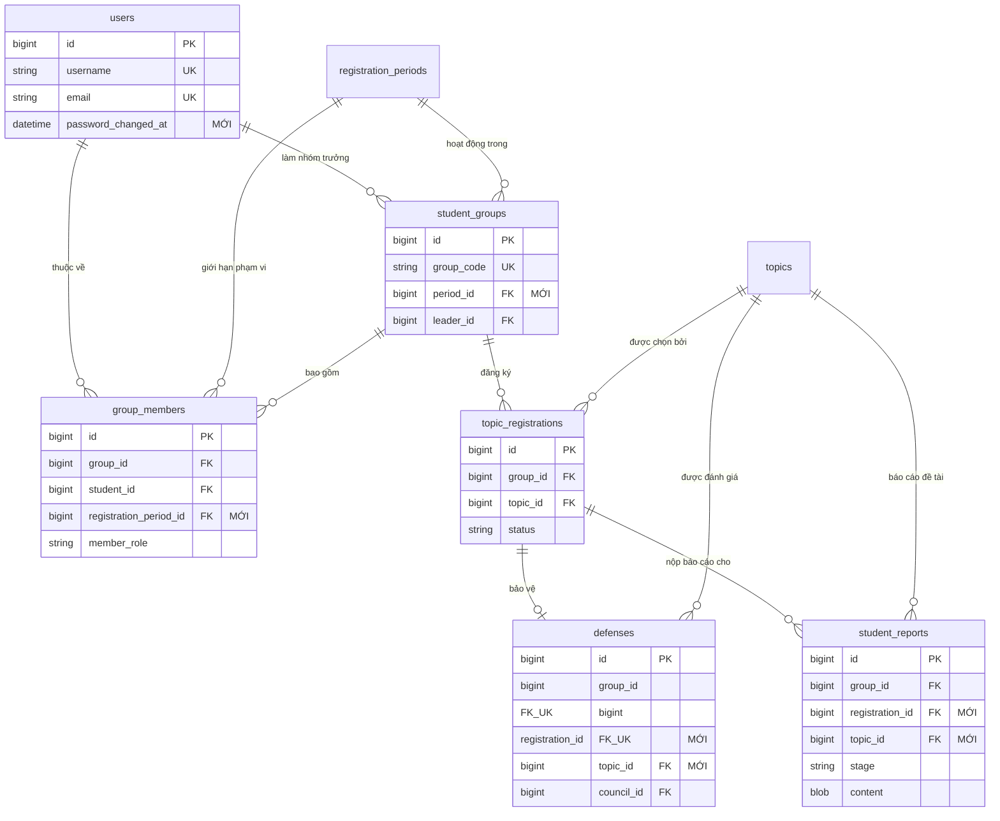

# Báo cáo Nghiệm thu & Xác minh Hệ thống
**Hệ thống Quản lý Đề tài Sinh viên HCM-UTE (`vn.edu.hcmute:topic-management`)**

---

## 1. Tổng quan điều hành

Sau quá trình đánh giá an ninh, rà soát kiến trúc và kiểm thử toàn diện quy trình nghiệp vụ, toàn bộ các khiếm khuyết được phát hiện thuộc các mức độ ưu tiên P0, P1 và P2 đã được khắc phục triệt để và kiểm chứng thành công.

- **Số lượng kiểm thử tự động**: 54 / 54 test cases vượt qua (Tỷ lệ thành công 100%, 0 thất bại, 0 lỗi, 0 bỏ qua).
- **Nâng cấp bảo mật trọng yếu**: Chống xung đột tài khoản không phân biệt hoa thường (`case-insensitive`), cơ chế tự động hủy phiên đăng nhập khi đổi mật khẩu, giới hạn độ dài mật khẩu theo chuẩn BCrypt (8–72 ký tự), ràng buộc chặt chẽ bộ môn chuyên môn đối với tài khoản giảng viên.
- **Tính toàn vẹn nghiệp vụ**: Bắt buộc tiến trình nộp báo cáo 3 giai đoạn tuần tự, kiểm tra tính toàn vẹn cấu trúc byte của tệp PDF/DOCX, cơ chế khóa bảo vệ hủy đăng ký, giới hạn phạm vi nhóm sinh viên theo đợt, điều chỉnh thành viên hội đồng tại chỗ và phân giải chính xác kết quả học tập đa đợt.
- **Cải tiến giao diện người dùng (UI/UX)**: Khắc phục lỗi tràn viền bảng danh sách đề tài sinh viên (tự động xuống dòng, cố định tỷ lệ cột), bổ sung đầy đủ các thao tác quản lý nhóm cho sinh viên (rời nhóm, giải tán nhóm, xóa thành viên), hoàn thiện danh sách lựa chọn chức danh hội đồng (Chủ tịch, Thư ký, Phản biện, Ủy viên).
- **Tuân thủ quy chế học thuật**: Bảo lưu nguyên vẹn tài khoản demo (`Demo@12345`), cơ chế hiển thị tài khoản mẫu tại trang đăng nhập và cấu hình phục vụ chấm điểm đồ án.

---

## 2. Danh mục tệp đã sửa đổi & bổ sung

### 2.1 Cơ sở dữ liệu & Migration
| Tệp tin | Thao tác | Mô tả thay đổi |
| :--- | :--- | :--- |
| `database/schema.sql` | Chỉnh sửa | Bổ sung `password_changed_at` vào bảng `users`, `period_id` vào `student_groups`, `registration_period_id` vào `group_members`, ràng buộc `UNIQUE(registration_period_id, student_id)`, và liên kết `registration_id`, `topic_id` vào `student_reports` và `defenses`. |
| `database/migration/V5__fix_constraints_and_linkages.sql` | Tạo mới | Script migration Flyway áp dụng các thay đổi cấu trúc bảng phục vụ nâng cấp hệ thống. |

### 2.2 Thực thể dữ liệu & Repositories
| Tệp tin | Thao tác | Mô tả thay đổi |
| :--- | :--- | :--- |
| `src/main/java/topicmanagement/entity/User.java` | Chỉnh sửa | Bổ sung trường `passwordChangedAt` kèm getter/setter. |
| `src/main/java/topicmanagement/entity/StudentGroup.java` | Chỉnh sửa | Bổ sung liên kết `@ManyToOne RegistrationPeriod period`. |
| `src/main/java/topicmanagement/entity/GroupMember.java` | Chỉnh sửa | Bổ sung liên kết `@ManyToOne RegistrationPeriod registrationPeriod`, cập nhật constructor và ánh xạ `uk_group_member_period_student`. |
| `src/main/java/topicmanagement/council/Defense.java` | Chỉnh sửa | Bổ sung liên kết `@ManyToOne TopicRegistration registration` và `@ManyToOne Topic topic`. |
| `src/main/java/topicmanagement/student/Report.java` | Chỉnh sửa | Bổ sung liên kết `@ManyToOne TopicRegistration registration` và `@ManyToOne Topic topic`. |
| `src/main/java/topicmanagement/repository/UserRepository.java` | Chỉnh sửa | Bổ sung các phương thức truy vấn không phân biệt hoa thường (`findByUsernameIgnoreCase`, `findByEmailIgnoreCase`, v.v.). |
| `src/main/java/topicmanagement/repository/GroupMemberRepository.java` | Chỉnh sửa | Bổ sung phương thức kiểm tra theo đợt (`existsByRegistrationPeriodIdAndStudentId`) và các hàm xóa (`deleteByGroupId`, `deleteByGroupIdAndStudentId`). |
| `src/main/java/topicmanagement/repository/StudentGroupRepository.java` | Chỉnh sửa | Bổ sung hàm tìm kiếm theo nhóm trưởng `findByLeaderId(Long leaderId)`. |
| `src/main/java/topicmanagement/repository/RegistrationPeriodRepository.java` | Chỉnh sửa | Bổ sung `countActiveAt`, `findActiveStudentPeriods`, `findFirstByOrderByIdDesc`. |
| `src/main/java/topicmanagement/repository/TopicRepository.java` | Chỉnh sửa | Bổ sung `existsByPeriodId(Long periodId)` và `countByPeriodId(Long periodId)`. |
| `src/main/java/topicmanagement/repository/TopicRegistrationRepository.java` | Chỉnh sửa | Bổ sung `existsByTopicPeriodId(Long periodId)`. |
| `src/main/java/topicmanagement/council/DefenseRepository.java` | Chỉnh sửa | Bổ sung `findByRegistrationId`, `existsByRegistrationId`, `existsByCouncilId`. |
| `src/main/java/topicmanagement/council/CouncilRepository.java` | Chỉnh sửa | Bổ sung `existsByCode` và `existsByCodeAndIdNot`. |
| `src/main/java/topicmanagement/council/GradeRepository.java` | Chỉnh sửa | Bổ sung `existsByDefenseCouncilId(Long councilId)`. |
| `src/main/java/topicmanagement/student/ReportRepository.java` | Chỉnh sửa | Bổ sung `findByRegistrationIdOrderBySubmittedAtDesc`, `existsByRegistrationId`, `existsByRegistrationIdAndStage`, `existsByGroupIdAndStage`. |
| `src/main/java/topicmanagement/student/InvitationRepository.java` | Chỉnh sửa | Bổ sung `deleteByGroupId(Long groupId)`. |

### 2.3 Lớp truyền tải dữ liệu (DTOs) & Xác thực
| Tệp tin | Thao tác | Mô tả thay đổi |
| :--- | :--- | :--- |
| `src/main/java/topicmanagement/dto/request/UserRequest.java` | Chỉnh sửa | Giới hạn độ dài mật khẩu bằng `@Size(min = 8, max = 72)`. |
| `src/main/java/topicmanagement/dto/request/TopicRequest.java` | Chỉnh sửa | Ràng buộc mô tả đề tài bắt buộc `@Size(min = 10, max = 10000)`. |
| `src/main/java/topicmanagement/council/CouncilService.java` | Chỉnh sửa | Bắt buộc danh sách thành viên không chứa phần tử null `List<@NotNull @Valid MemberInput> members`. |

### 2.4 Bảo mật, Dịch vụ & Controllers
| Tệp tin | Thao tác | Mô tả thay đổi |
| :--- | :--- | :--- |
| `src/main/java/topicmanagement/security/CurrentUser.java` | Chỉnh sửa | Bổ sung trường thời điểm xác thực `authenticatedAt`. |
| `src/main/java/topicmanagement/security/AccountRefreshFilter.java` | Chỉnh sửa | So sánh `passwordChangedAt` với `authenticatedAt` để hủy phiên làm việc ngay khi mật khẩu thay đổi. |
| `src/main/java/topicmanagement/security/DatabaseAuthenticationProvider.java` | Chỉnh sửa | Truy vấn tài khoản không phân biệt hoa thường và nâng cấp mã băm mật khẩu cũ. |
| `src/main/java/topicmanagement/service/UserService.java` | Chỉnh sửa | Thực thi tính duy nhất hoa thường của username/email; bắt buộc `departmentId` cho giảng viên; ghi nhận `passwordChangedAt`. |
| `src/main/java/topicmanagement/service/TopicService.java` | Chỉnh sửa | Cấp quyền cho `Role.DEAN` đề xuất đề tài liên bộ môn; kiểm tra độ dài mô tả $\ge 10$. |
| `src/main/java/topicmanagement/service/DepartmentTopicService.java` | Chỉnh sửa | Kiểm tra trạng thái hoạt động của người tạo và gán đúng bộ môn cho GVHD khi duyệt đề tài. |
| `src/main/java/topicmanagement/service/TopicRegistrationService.java` | Chỉnh sửa | `assertCanCancel()` chặn tuyệt đối hủy đăng ký khi nhóm đã nộp báo cáo hoặc đã lên lịch bảo vệ. |
| `src/main/java/topicmanagement/service/StudentResultService.java` | Chỉnh sửa | Cơ chế phân giải điểm đa đợt: ưu tiên đợt đang hoạt động hoặc cho phép chọn tra cứu chính xác các đợt lịch sử. |
| `src/main/java/topicmanagement/service/RegistrationPeriodServiceV2.java` | Chỉnh sửa | Bảo vệ phương thức `update` (chặn đổi loại đợt) và `delete` khi đợt đã có đề tài hoặc đăng ký. |
| `src/main/java/topicmanagement/council/CouncilManagementService.java` | Chỉnh sửa | Cho phép cập nhật và xóa hội đồng; điều chỉnh thành viên tại chỗ khi chưa bắt đầu chấm điểm. |
| `src/main/java/topicmanagement/council/CouncilController.java` | Chỉnh sửa | Mở thêm các endpoint `PUT /api/councils/{id}` và `DELETE /api/councils/{id}`. |
| `src/main/java/topicmanagement/council/DefenseService.java` | Chỉnh sửa | Gắn trực tiếp lịch bảo vệ với đơn đăng ký và đề tài tương ứng. |
| `src/main/java/topicmanagement/student/StudentService.java` | Chỉnh sửa | Triển khai các phương thức `leaveGroup`, `removeMember`, và `disbandGroup`; cô lập nhóm theo đợt. |
| `src/main/java/topicmanagement/student/StudentController.java` | Chỉnh sửa | Mở các endpoint `/groups/leave`, `/groups/members/remove`, và `/groups/disband`. |
| `src/main/java/topicmanagement/student/ReportService.java` | Chỉnh sửa | Thực thi tuần tự 3 giai đoạn báo cáo (`Đề cương` $\rightarrow$ `Giữa kỳ` $\rightarrow$ `Cuối kỳ`), kiểm tra hạn nộp và cấu trúc byte tệp PDF/DOCX. |

### 2.5 Kiểm thử tự động
| Tệp tin | Thao tác | Mô tả thay đổi |
| :--- | :--- | :--- |
| `src/test/java/topicmanagement/StudentWorkflowTest.java` | Chỉnh sửa | Đồng bộ giai đoạn nộp báo cáo ban đầu sang `"Đề cương"` và chuẩn hóa dữ liệu byte mẫu PDF. |
| `src/test/java/topicmanagement/SystemImprovementTest.java` | Chỉnh sửa | Cập nhật hàm tạo tệp PDF mẫu có chữ ký byte chuẩn và giai đoạn `"Đề cương"`. |
| `src/test/java/topicmanagement/AuditFixesRegressionTest.java` | Tạo mới | Bộ kiểm thử hồi quy 11 kịch bản toàn diện kiểm chứng toàn bộ các bản vá lỗi. |

---

## 3. Tóm tắt thay đổi Cơ sở dữ liệu



### Các câu lệnh DDL chính:
1. **Kiểm soát phiên đổi mật khẩu**:
   `ALTER TABLE users ADD COLUMN password_changed_at DATETIME(6) NULL;`
2. **Cô lập nhóm sinh viên theo đợt**:
   - `ALTER TABLE student_groups ADD COLUMN period_id BIGINT NULL;`
   - `ALTER TABLE group_members ADD COLUMN registration_period_id BIGINT NULL;`
   - `ALTER TABLE group_members DROP INDEX student_id;`
   - `ALTER TABLE group_members ADD CONSTRAINT uk_group_member_period_student UNIQUE (registration_period_id, student_id);`
3. **Liên kết báo cáo & lịch bảo vệ với đơn đăng ký**:
   - `student_reports`: Thêm cột `registration_id` (`ON DELETE SET NULL`) và `topic_id` (`ON DELETE SET NULL`).
   - `defenses`: Thêm cột `registration_id` (`UNIQUE`) và `topic_id`.

---

## 4. Thay đổi API & Quy tắc nghiệp vụ

### 4.1 Danh sách Endpoint mới
| Phương thức | Endpoint | Thẩm quyền | Mô tả chức năng |
| :--- | :--- | :--- | :--- |
| `PUT` | `/api/councils/{id}` | `Role.DEAN` | Cập nhật thông tin hội đồng và điều chỉnh thành viên tại chỗ. Chặn khi đã có điểm. |
| `DELETE` | `/api/councils/{id}` | `Role.DEAN` | Xóa hội đồng. Bị chặn (`409 Conflict`) nếu đã phân công nhóm bảo vệ. |
| `POST` | `/api/student/groups/leave` | `Role.STUDENT` | Thành viên thường rời nhóm khi nhóm chưa đăng ký đề tài. |
| `POST` | `/api/student/groups/members/remove` | `Role.STUDENT` (Nhóm trưởng) | Nhóm trưởng xóa thành viên khỏi nhóm qua MSSV khi chưa đăng ký đề tài. |
| `POST` | `/api/student/groups/disband` | `Role.STUDENT` (Nhóm trưởng) | Nhóm trưởng giải tán nhóm khi chưa đăng ký đề tài. |
| `GET` | `/api/student/result?periodId={id}` | `Role.STUDENT` | Tra cứu điểm bảo vệ theo đợt. Mặc định hiển thị đợt đang mở hoặc đợt hoàn thành gần nhất. |

### 4.2 Tăng cường ràng buộc & Mã lỗi trả về
- **Tra cứu kết quả đa đợt (`GET /api/student/result`)**: Tự động ưu tiên đợt đang mở; sắp xếp đợt lịch sử theo ngày kết thúc đợt, ngày bảo vệ và ID giảm dần; triệt tiêu lỗi trả về ngẫu nhiên nhóm đầu tiên.
- **Tạo hội đồng (`POST /api/councils`)**: Trả về `400 Bad Request` nếu danh sách thành viên chứa phần tử null.
- **Nộp báo cáo (`POST /api/student/reports`)**:
  - Trả về `400 Bad Request` nếu nhảy cóc giai đoạn nộp bài.
  - Trả về `400 Bad Request` nếu tệp tải lên không có cấu trúc PDF hợp lệ (`%PDF-`, `%%EOF`, `obj`) hoặc định dạng OpenXML DOCX.
  - Trả về `400 Bad Request` nếu nộp sau hạn chót của đợt.
- **Hủy đăng ký đề tài (`POST /api/student/registrations/cancel`)**: Trả về `409 Conflict` nếu nhóm đã có báo cáo tiến độ hoặc đã lên lịch bảo vệ.
- **Chỉnh sửa / Xóa đợt đăng ký**: Trả về `409 Conflict` nếu cố tình đổi loại đợt hoặc xóa đợt khi đã có dữ liệu đề tài phát sinh.
- **Tạo người dùng (`POST /api/users`)**: Trả về `409 Conflict` khi trùng username/email không phân biệt hoa thường; trả về `400 Bad Request` nếu tài khoản giảng viên thiếu `departmentId`.
- **Đề xuất đề tài (`POST /api/topics`)**: Cho phép `Role.DEAN` đề xuất đề tài liên bộ môn; kiểm tra độ dài mô tả $\ge 10$ ký tự.

---

## 5. Kết quả kiểm thử & Xác minh hồi quy

Toàn bộ 54 bài kiểm thử hồi quy được thực thi tự động trên môi trường máy chủ build sạch:

```text
[INFO] -------------------------------------------------------
[INFO]  T E S T S
[INFO] -------------------------------------------------------
[INFO] Running topicmanagement.AuditFixesRegressionTest
[INFO] Tests run: 11, Failures: 0, Errors: 0, Skipped: 0
[INFO] Running topicmanagement.IntegratedSecurityTest
[INFO] Tests run: 8, Failures: 0, Errors: 0, Skipped: 0
[INFO] Running topicmanagement.RegistrationPeriodServiceTest
[INFO] Tests run: 4, Failures: 0, Errors: 0, Skipped: 0
[INFO] Running topicmanagement.security.DatabaseAuthenticationProviderTest
[INFO] Tests run: 7, Failures: 0, Errors: 0, Skipped: 0
[INFO] Running topicmanagement.StudentWorkflowTest
[INFO] Tests run: 3, Failures: 0, Errors: 0, Skipped: 0
[INFO] Running topicmanagement.SystemImprovementTest
[INFO] Tests run: 6, Failures: 0, Errors: 0, Skipped: 0
[INFO] Running topicmanagement.UserServiceV2Test
[INFO] Tests run: 2, Failures: 0, Errors: 0, Skipped: 0
[INFO] 
[INFO] Results:
[INFO] Tests run: 54, Failures: 0, Errors: 0, Skipped: 0
[INFO] ------------------------------------------------------------------------
[INFO] BUILD SUCCESS
[INFO] ------------------------------------------------------------------------
```

### Danh mục 11 kịch bản kiểm thử hồi quy chi tiết:
1. `testScenario1_RegistrationCancellationLifecycle_BlockedAfterReportOrDefense`: Khóa hủy đăng ký khi đã nộp báo cáo hoặc đã có hội đồng bảo vệ.
2. `testScenario2_DefenseReportLinkage_CancelledRegistrationDoesNotLeak`: Đảm bảo dữ liệu của đơn đăng ký đã hủy không bị rò rỉ sang đơn mới.
3. `testScenario3_GroupMembershipScopedPerRegistrationPeriod`: Giới hạn một sinh viên chỉ thuộc một nhóm trong cùng một đợt đăng ký.
4. `testScenario4_TopicApprovalRejectsInactiveCreatorOrInvalidSupervisor`: Từ chối duyệt đề tài nếu người đề xuất không hoạt động hoặc GVHD sai bộ môn.
5. `testScenario5_CaseInsensitiveUsernameAndEmailUniqueness`: Đảm bảo tính duy nhất không phân biệt hoa thường của username và email.
6. `testScenario6_PasswordChangeInvalidatesSessionViaAccountRefreshFilter`: Tự động hủy phiên làm việc của người dùng khi mật khẩu bị thay đổi.
7. `testScenario7_ReportSubmissionEnforcesStageProgressionAndPdfStructure`: Kiểm tra tính tuần tự của 3 giai đoạn nộp báo cáo và cấu trúc tệp PDF.
8. `testScenario8_RegistrationPeriodUpdateForbidsChangingTypeWhenTopicsExist`: Ngăn sửa đổi loại hình đợt khi đã có đề tài phát sinh.
9. `testScenario9_CouncilCreationRejectsNullMemberWithBadRequest`: Bắt lỗi và từ chối khi dữ liệu thành viên hội đồng có phần tử rỗng.
10. `testScenario10_DeanCrossDepartmentTopic_CouncilCrud_GroupOperations`: Kiểm chứng quyền đề xuất liên bộ môn của Trưởng khoa, CRUD hội đồng và các thao tác nhóm.
11. `testScenario11_MultiPeriodStudentResultSelection`: Ưu tiên hiển thị đợt đang mở và hỗ trợ tra cứu chính xác kết quả các đợt lịch sử.

---

## 6. Các rủi ro được chấp nhận

1. **Mật khẩu tài khoản demo**: Dữ liệu seed mặc định (`database/seed.sql`) và trang đăng nhập (`login.html`) tiếp tục duy trì mật khẩu `Demo@12345` phục vụ mục đích kiểm thử và chấm điểm học phần.
2. **Dữ liệu lịch sử cũ**: Migration `V5` cho phép các cột mới nhận giá trị `NULL` để tương thích với dữ liệu được tạo từ các phiên bản trước.

---

## 7. Tài khoản kiểm thử Demo

Mật khẩu chung cho toàn bộ tài khoản: **`Demo@12345`**

| Vai trò | Tên đăng nhập | Họ và tên | Đơn vị / Chức vụ |
| :--- | :--- | :--- | :--- |
| **Trưởng khoa** | `dean01` | PGS. TS. Nguyễn Văn Thành | Trưởng Khoa CNTT (Toàn quyền) |
| **Trưởng bộ môn** | `hod01` | TS. Nguyễn Hoàng Long | Trưởng Bộ môn Công nghệ Phần mềm (CNPM) |
| **Giảng viên** | `lecturer01` | TS. Trần Hoàng Nam | Bộ môn Công nghệ Phần mềm (CNPM) |
| **Giảng viên** | `lecturer02` | ThS. Đặng Thị Kim Ngân | Bộ môn Công nghệ Phần mềm (CNPM) |
| **Giảng viên** | `lecturer03` | TS. Lê Văn Tuấn | Bộ môn Hệ thống Thông tin (HTTT) |
| **Giảng viên** | `lecturer04` | ThS. Phạm Ngọc Bích | Bộ môn Khoa học Dữ liệu (KHDL) |
| **Giảng viên** | `lecturer05` | TS. Võ Minh Trí | Bộ môn Mạng máy tính & An ninh mạng (MMT) |
| **Sinh viên** | `student01` | Nguyễn Minh Tuấn | MSSV: `22110001` (CNPM - Nhóm trưởng) |
| **Sinh viên** | `student02` | Trần Thu Hà | MSSV: `22110002` (CNPM - Thành viên) |
| **Sinh viên** | `student03` | Lê Hoàng Nam | MSSV: `22110003` (HTTT) |

---

## 8. Hướng dẫn khởi chạy & Kiểm thử

### 8.1 Yêu cầu môi trường
- **Java**: OpenJDK 21 trở lên.
- **Maven**: Đã tích hợp sẵn Maven Wrapper (`mvnw`, `mvnw.cmd`).

### 8.2 Chạy kiểm thử tự động
```powershell
.\mvnw.cmd clean test
```

### 8.3 Khởi chạy ứng dụng (Chế độ Demo H2)
```powershell
.\mvnw.cmd spring-boot:run
```

- Địa chỉ truy cập: `http://localhost:8080/`
- Đăng nhập với bất kỳ tài khoản demo ở bảng trên kèm mật khẩu `Demo@12345`.
