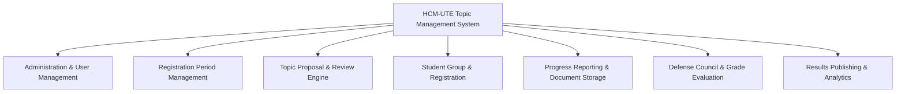

# Project Overview: HCM-UTE Student Topic Management System

## 1. Introduction

The **Student Topic Management System** (`vn.edu.hcmute:topic-management`) is a web-based enterprise academic platform engineered for the **Faculty of Information Technology at Ho Chi Minh City University of Technology and Education (HCM-UTE)**. 

The system digitizes and governs the end-to-end academic project lifecycle, spanning **Course Projects (`COURSE`)**, **Scientific Research (`NCKH`)**, **Specialized Projects (`TLCN`)**, and **Graduation Theses (`KLTN`)**. It provides an integrated environment connecting Faculty Leadership, Department Heads, Academic Supervisors, Defense Councils, and Student Groups.

---

## 2. Key Objectives & Business Value

1. **Process Standardization**: Replaces manual spreadsheets and paper forms with strict digital state machines and deadline-driven registration periods.
2. **Academic Integrity & Governance**: Enforces institutional regulations such as supervisor conflict-of-interest prevention on defense councils, cross-period student group isolation, sequential report submissions, and multi-member grade synthesis.
3. **Transparency & Real-time Collaboration**: Provides students, lecturers, and faculty leaders with real-time dashboards, instantaneous status updates, automated notifications, and grade transparency upon publication.
4. **Security & Data Isolation**: Guarantees role-based access control (RBAC), department-scoped administration, session invalidation on password updates, and secure document upload validation.

---

## 3. User Roles & Responsibilities

The system defines four distinct user personas:

| Role | Role Code | Scope & Key Responsibilities |
| :--- | :--- | :--- |
| **Dean / Faculty Admin** | `ROLE_DEAN` | Faculty-wide administrative authority. Creates and configures registration periods, oversees all departments and users, proposes cross-department topics, forms defense councils, assigns councils to student groups, and officially publishes final grades. |
| **Head of Department** | `ROLE_HEAD_OF_DEPT` | Departmental authority. Reviews, approves, or rejects topic proposals within their department, assigns primary and secondary advisors (`advisor_1`, `advisor_2`), approves student group registrations, and monitors department progress. |
| **Lecturer / Faculty Member** | `ROLE_LECTURER` | Academic supervisor and council member. Proposes topics during faculty proposal windows, evaluates assigned student registrations, grades defense presentations (as Council Chairperson, Secretary, Reviewer, or Member), and enters feedback. |
| **Student** | `ROLE_STUDENT` | Project researcher. Forms student groups (1–3 members), invites peers, registers available topics in their department, submits multi-stage progress reports (Proposal, Midterm, Final), tracks defense schedules, and views published grades. |

---

## 4. Core Functional Modules

### 4.1 Administration & Account Management
- Case-insensitive credential management and collision prevention.
- Dynamic password updates with automatic session termination.
- Department mapping and faculty directory management.
- Brute-force login rate limiting and security event logging.

### 4.2 Registration Period Lifecycle
- Two-phase time windows: **Lecturer Proposal Window** (`lecturer_start` $\rightarrow$ `lecturer_end`) followed by **Student Registration Window** (`student_start` $\rightarrow$ `student_end`).
- Academic project category specialization: `COURSE`, `NCKH`, `TLCN`, `KLTN`.
- Automated deadline validation preventing actions outside authorized windows.
- Mutation protection: Prevents altering period types or deleting periods once topics or registrations exist.

### 4.3 Topic Proposal & Approval Workflow
- Lecturers propose topics with quotas, prerequisites, and department categorization.
- Deans can propose cross-departmental or institutional topics.
- Department Heads review proposals prior to student registration windows.
- Automatic advisor assignment and quota tracking.

### 4.4 Student Group & Registration
- Dynamic group creation with unique group codes.
- Invitation lifecycle: invite, accept, decline, remove member, leave group, and group disbanding.
- Strict period scoping: each student belongs to at most one group per registration period.
- Topic registration with competitive approval or advisor selection.
- Cancellation safeguards: registrations cannot be cancelled once progress reports or scheduled defenses exist.

### 4.5 Progress Report & Document Validation
- Sequential stage progression: **Proposal (`Đề cương`)** $\rightarrow$ **Midterm (`Giữa kỳ`)** $\rightarrow$ **Final (`Cuối kỳ`)**.
- Strict structural document validation: authenticates PDF headers (`%PDF-`), EOF markers (`%%EOF`), structural objects, or valid OpenXML (DOCX) schemas up to 10 MB.
- Version history and secure download capabilities.

### 4.6 Council Management & Grade Evaluation
- Councils composed of 3 to 5 faculty members with designated roles: **Chairperson (`CHAIRPERSON`)**, **Secretary (`SECRETARY`)**, **Reviewer (`REVIEWER`)**, and **Members (`MEMBER`)**.
- Conflict-of-interest enforcement: Supervising advisors cannot serve on the defense council for their own students.
- In-place council member updates and safe deletion validations.
- Independent score submission by each council member.
- Chairperson synthesis: computes weighted arithmetic average once all member scores are submitted.
- Dean final approval and instant grade publication.

---

## 5. Technology Stack Summary

| Layer | Technologies |
| :--- | :--- |
| **Backend Framework** | Java 21 LTS, Spring Boot 3.5.16, Spring MVC, Spring Security 6, Spring Data JPA |
| **Database** | MySQL 8.0+ (Production) / H2 In-Memory & File-based (Testing & Development) |
| **Database Migration**| Flyway Migration Framework (`database/migration/V2..V5`) |
| **Frontend UI** | Thymeleaf, Modern HTML5, Responsive CSS3 (HCM-UTE Design Language), Vanilla JavaScript ES6+ |
| **Build & Tooling** | Apache Maven 3.9+, Maven Wrapper (`mvnw`, `mvnw.cmd`) |
| **Testing** | JUnit 5 Jupiter, Mockito, Spring Boot Test, H2 In-Memory Test Suite |

---

## 6. Documentation Directory Index

For technical details, please refer to the specialized documentation in the `docs/` folder:

- **[System Architecture](SYSTEM_ARCHITECTURE.md)**: Architectural patterns, security filter chain, and subsystem interactions.
- **[Database Design](DATABASE_DESIGN.md)**: Entity-relationship diagrams, table schemas, foreign keys, and indexes.
- **[Business Workflow](BUSINESS_WORKFLOW.md)**: Detailed phase transitions, lifecycle state machines, and edge case rules.
- **[REST API Documentation](API_DOCUMENTATION.md)**: API catalog, request/response formats, status codes, and authorization rules.
- **[Manual Testing Scenario](MANUAL_TESTING_SCENARIO.md)**: Step-by-step QA guide and end-to-end verification checklist.
- **[Final Verification Report](FINAL_VERIFICATION_REPORT.md)**: Complete audit resolution report, test metrics, and security fixes.
- **[Deployment Guide](DEPLOYMENT_GUIDE.md)**: Production deployment instructions, environment configuration, and operational checklist.
