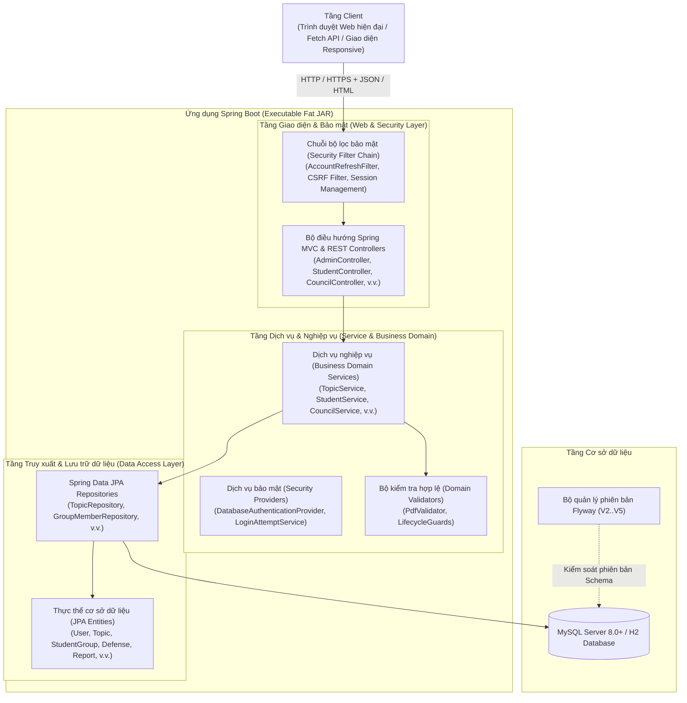
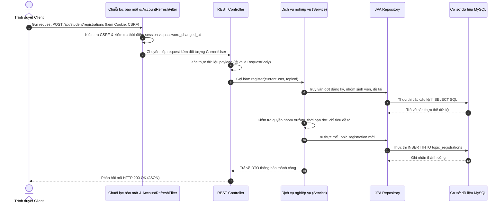

# Kiến trúc hệ thống: Hệ thống Quản lý Đề tài Sinh viên HCM-UTE

## 1. Mô hình kiến trúc tổng quan

**Hệ thống Quản lý Đề tài Sinh viên HCM-UTE** được xây dựng theo mô hình **Kiến trúc phân tầng (N-Tier / Layered Architecture)** chuẩn công nghiệp, bảo đảm tính độc lập, khả năng mở rộng, khả năng kiểm thử và mức độ bảo mật cao giữa các thành phần.

---

## 2. Trách nhiệm của từng tầng kiến trúc

### 2.1 Tầng Giao diện & Web (Presentation Layer)
- **Thymeleaf Template Controllers**: Xử lý điều hướng và kết xuất giao diện HTML phía máy chủ với hệ thống bố cục dùng chung (`login.html`, `admin.html`, `lecturer.html`, `student.html`, `councils/index.html`).
- **RESTful API Controllers**: Cung cấp các endpoint REST trả về dữ liệu định dạng JSON theo tiền tố `/api/**` với các phương thức HTTP chuẩn (`GET`, `POST`, `PUT`, `DELETE`).
- **Xác thực dữ liệu đầu vào (Input Validation)**: Ứng dụng các annotation chuẩn JSR-380 (`jakarta.validation`) như `@Valid`, `@NotNull`, `@Size`, `@NotBlank` để sàng lọc dữ liệu ngay từ controller trước khi chuyển vào tầng dịch vụ.
- **Xử lý ngoại lệ tập trung (Unified Error Handling)**: Bắt và chuẩn hóa các lỗi nghiệp vụ hoặc hệ thống thành cấu trúc JSON thống nhất với mã trạng thái HTTP chuẩn (400, 401, 403, 404, 409, 500).

### 2.2 Tầng Bảo mật & Xác thực (Security Layer)
- **Spring Security Filter Chain**: Chặn và kiểm tra mọi yêu cầu HTTP để kiểm soát quyền hạn theo vai trò và tính hợp lệ của phiên đăng nhập.
- **Đối tượng định danh `CurrentUser`**: Đại diện phiên người dùng an toàn luồng (thread-safe), chứa các thông tin ngữ cảnh: `id`, `username`, `role`, `departmentId`, `authenticatedAt`.
- **`DatabaseAuthenticationProvider`**: Thực hiện truy vấn tài khoản không phân biệt hoa thường và đối soát mật khẩu với giải thuật băm BCrypt.
- **Bộ lọc kiểm tra phiên `AccountRefreshFilter`**: Trên mỗi yêu cầu được xác thực, bộ lọc so sánh thời điểm đăng nhập của session với trường `password_changed_at` trong cơ sở dữ liệu. Nếu mật khẩu đã bị đổi sau thời điểm đăng nhập, phiên lập tức bị hủy bỏ và chuyển hướng về trang đăng nhập.
- **Kiểm soát đăng nhập thất bại `LoginAttemptService`**: Theo dõi số lần đăng nhập sai theo IP/Username trong cửa sổ 15 phút để chủ động ngăn chặn tấn công brute-force.
- **Bảo vệ CSRF & Cookie**: Sử dụng `CookieCsrfTokenRepository` với các cờ bảo mật `HttpOnly=true`, `SameSite=Lax`, cơ chế tự động đổi Session ID khi đăng nhập thành công.

### 2.3 Tầng Dịch vụ Nghiệp vụ (Business Service Layer)
- Đóng gói toàn bộ các chính sách, quy tắc đào tạo và máy trạng thái nghiệp vụ:
  - **`RegistrationPeriodServiceV2`**: Thực thi quy tắc 4 mốc thời gian, kiểm soát vòng đời đợt đăng ký; ngăn chặn việc thay đổi loại đợt hoặc xóa đợt khi đã có đề tài hoặc nhóm sinh viên phát sinh.
  - **`TopicService` & `DepartmentTopicService`**: Quản lý đề xuất đề tài, phân bổ chỉ tiêu giảng viên hướng dẫn, kiểm tra tính hợp lệ của người tạo và bộ môn của đề tài.
  - **`StudentService`**: Xử lý tạo nhóm, gửi lời mời, chuyển quyền nhóm trưởng, rời nhóm, xóa thành viên và giải tán nhóm với phạm vi giới hạn theo từng đợt đăng ký.
  - **`TopicRegistrationService`**: Điều phối luồng đăng ký đề tài, duyệt đăng ký và kích hoạt cơ chế khóa hủy đăng ký khi nhóm đã bắt đầu nộp báo cáo.
  - **`ReportService`**: Ràng buộc nộp báo cáo tuần tự theo 3 giai đoạn (`Đề cương` $\rightarrow$ `Giữa kỳ` $\rightarrow$ `Cuối kỳ`), kiểm tra cấu trúc byte của tệp PDF và DOCX.
  - **`CouncilManagementService`, `CouncilService`, `DefenseService`**: Thực thi cơ cấu thành viên hội đồng (3-5 người), ngăn ngừa xung đột lợi ích (giảng viên hướng dẫn không được chấm đề tài mình), thu thập điểm số và tổng hợp điểm trung bình cộng.
  - **`StudentResultService`**: Thực hiện cơ chế phân giải kết quả đa đợt: ưu tiên đợt đang hoạt động hoặc cho phép chọn tra cứu chính xác các đợt lịch sử đã kết thúc.

### 2.4 Tầng Truy xuất & Lưu trữ Dữ liệu (Persistence Layer)
- **Spring Data JPA**: Cung cấp các giao diện repository trừu tượng hóa truy vấn, hỗ trợ phân trang và các phương thức truy vấn suy diễn (derived queries).
- **Hibernate ORM**: Quản lý vòng đời thực thể, cơ chế dirty-checking, khóa lạc quan (`@Version`) và ánh xạ quan hệ bảng.
- **Flyway Migrations**: Quản lý lịch sử tiến hóa cấu trúc cơ sở dữ liệu từ phiên bản `V2` đến `V5`, bảo đảm tính đồng nhất giữa môi trường phát triển và môi trường thực tế.

---

## 3. Vòng đời xử lý yêu cầu End-to-End

---

## 4. Các giải pháp an ninh chuyên sâu

### 4.1 Chống xung đột định danh không phân biệt hoa thường
Tại tầng cơ sở dữ liệu và repository, việc tìm kiếm và tạo mới tài khoản sử dụng các phương thức tường minh (`findByUsernameIgnoreCase`, `findByEmailIgnoreCase`) kết hợp collation `utf8mb4_unicode_ci`. Điều này triệt tiêu hoàn toàn nguy cơ giả mạo định danh hoặc tạo tài khoản trùng lặp (ví dụ: `Student01` và `student01`).

### 4.2 Động cơ kiểm tra cấu trúc tệp an toàn (`ReportService`)
Để ngăn ngừa việc tải lên mã độc hoặc tệp độc hại:
1. **Kiểm tra phần mở rộng & MIME-Type**: Chỉ chấp nhận đuôi `.pdf` và `.docx`.
2. **Kiểm tra chữ ký byte (Magic Numbers)**: Kiểm tra chuỗi định danh `%PDF-` ở đầu tệp và `%%EOF` ở cuối tệp đối với PDF.
3. **Kiểm tra cấu trúc đối tượng nội tại**: Quét mảng byte để bảo đảm có các khối đối tượng hợp lệ (`obj` / `endobj`).
4. **Phòng chống ZIP Bomb / XML Bomb**: Phân tích luồng nén OpenXML của tệp `.docx` với giới hạn tỷ lệ bung nén nghiêm ngặt.
5. **Giới hạn kích thước tệp**: Chặn tuyệt đối các tệp vượt quá 10 MB.

### 4.3 Cơ chế ngăn ngừa xung đột lợi ích trong hội đồng bảo vệ
Khi Trưởng khoa thực hiện phân công hội đồng cho một nhóm sinh viên:
- Hệ thống kiểm tra mã giảng viên của `advisor1_id` và `advisor2_id` của đề tài.
- Nếu bất kỳ giảng viên hướng dẫn nào trùng khớp với danh sách thành viên trong hội đồng được chọn, thao tác phân công sẽ bị từ chối, bảo đảm tính khách quan tuyệt đối khi đánh giá.

---

## 5. Cấu hình môi trường & Đóng gói triển khai

Ứng dụng được đóng gói thành một tệp **Executable JAR** duy nhất chứa máy chủ Apache Tomcat nhúng:

- **Profile Mặc định / Demo (`default`)**:
  - Cơ sở dữ liệu nhúng H2 (dạng file hoặc in-memory).
  - Tự động đồng bộ schema (`ddl-auto=update`), khởi chạy tức thì phục vụ demo và kiểm thử tự động.
- **Profile Triển khai Thực tế (`mysql`)**:
  - Kết nối với máy chủ MySQL Server 8.0+.
  - Chế độ kiểm tra schema nghiêm ngặt (`ddl-auto=validate`), không tự ý sửa đổi cấu trúc bảng đang hoạt động.
  - Tiếp nhận thông tin kết nối qua các biến môi trường (`DB_URL`, `DB_USERNAME`, `DB_PASSWORD`).
  - Bật cờ bảo mật cookie HTTPS (`SESSION_COOKIE_SECURE=true`).
