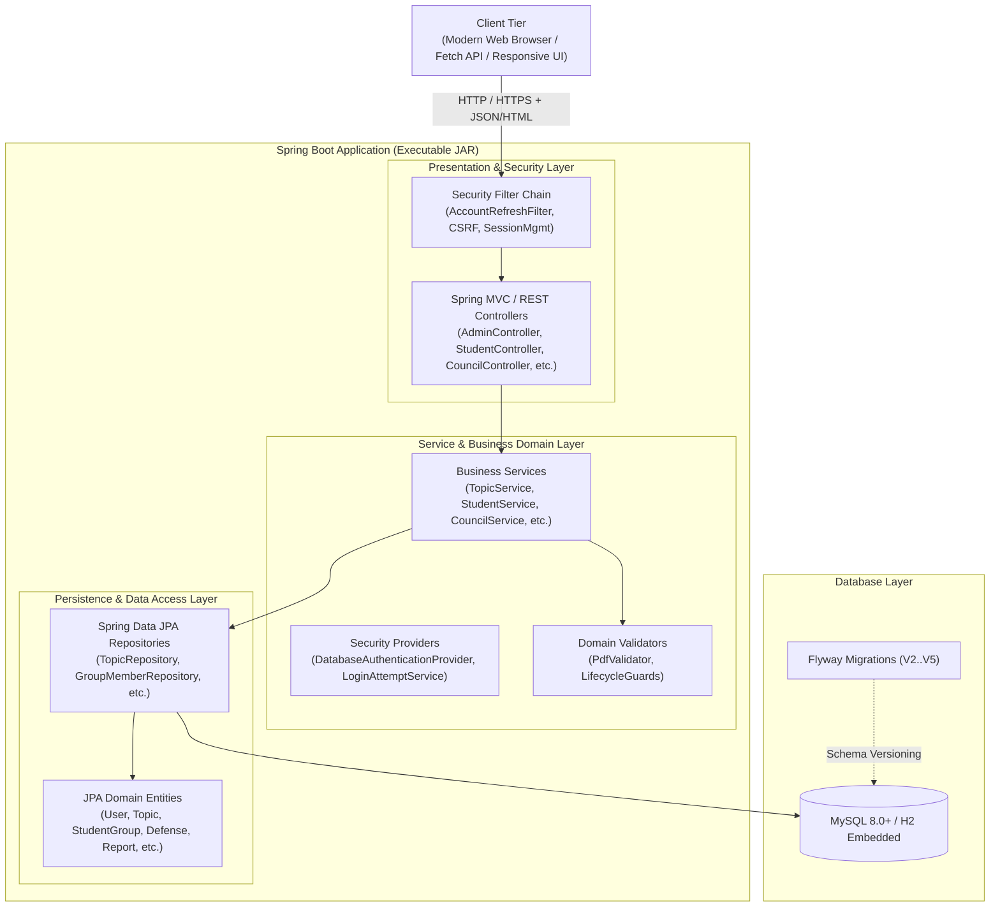
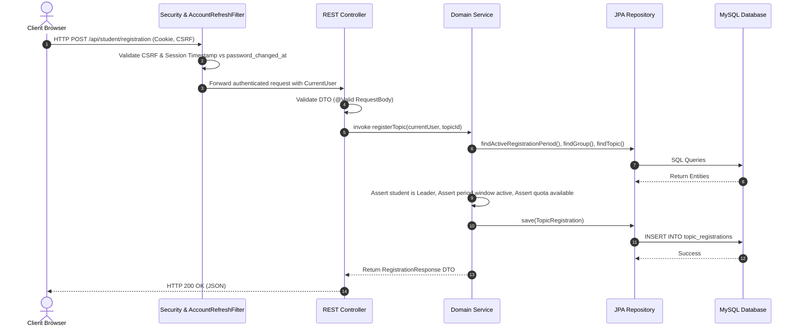

# System Architecture: HCM-UTE Student Topic Management System

## 1. Architectural Overview

The **HCM-UTE Student Topic Management System** follows a clean **Layered Architecture (N-Tier)** pattern, emphasizing separation of concerns, testability, security, and loose coupling.

---

## 2. Layer Responsibilities

### 2.1 Presentation & Web Layer
- **Thymeleaf Template Controllers**: Render server-side HTML views with shared layouts (`login.html`, `admin.html`, `lecturer.html`, `student.html`, `council.html`).
- **RESTful API Controllers**: Expose JSON-based REST endpoints under `/api/**` with standard HTTP verbs (`GET`, `POST`, `PUT`, `DELETE`).
- **Input Validation**: JSR-380 (`jakarta.validation`) annotations (`@Valid`, `@NotNull`, `@Size`, `@NotBlank`) validate inbound payload formats before reaching business logic.
- **Unified Error Handling**: Global exception interceptors format standard JSON error structures with meaningful HTTP status codes (400 Bad Request, 401 Unauthorized, 403 Forbidden, 404 Not Found, 409 Conflict, 500 Internal Server Error).

### 2.2 Security & Authentication Layer
- **Spring Security Filter Chain**: Intercepts every inbound request to enforce role authorization and session validity.
- **`CurrentUser` Principal**: Injects thread-safe contextual user identity (`id`, `username`, `role`, `departmentId`, `authenticatedAt`).
- **`DatabaseAuthenticationProvider`**: Performs case-insensitive credential resolution and BCrypt hash verification.
- **`AccountRefreshFilter`**: Evaluates each authenticated request against the database `password_changed_at` timestamp. If a password was updated after session creation, the filter immediately invalidates the active session and redirects to the login screen.
- **`LoginAttemptService`**: Tracks failed login attempts per client IP/username to mitigate brute-force credential stuffing.
- **CSRF & Session Security**: Employs `CookieCsrfTokenRepository` with `SameSite=Lax`, `HttpOnly=true`, and configurable `Secure` flags. Enforces session rotation upon login.

### 2.3 Business Domain & Service Layer
- Encapsulates all domain policies, temporal rules, and business logic:
  - **Period Service (`RegistrationPeriodServiceV2`)**: Enforces two-phase proposal and registration time windows. Prevents deletion or alteration of periods with existing dependencies.
  - **Topic Service (`TopicService`, `DepartmentTopicService`)**: Validates topic quotas, creator status, and departmental alignment.
  - **Student Group Service (`StudentService`)**: Controls group forming, period-scoped memberships, member removal, and safe group disbanding.
  - **Registration Service (`TopicRegistrationService`)**: Governs topic registration approvals, advisor assignments, and cancellation blocks.
  - **Report Service (`ReportService`)**: Enforces strict linear progression (`Đề cương` $\rightarrow$ `Giữa kỳ` $\rightarrow$ `Cuối kỳ`) and structural byte inspection for PDFs and DOCX archives.
  - **Council Management Service (`CouncilManagementService`, `CouncilService`, `DefenseService`)**: Enforces council role distributions, conflict-of-interest prevention (advisors cannot judge their own topics), score collection, and chairperson arithmetic synthesis.
  - **Student Result Service (`StudentResultService`)**: Implements deterministic multi-period resolution, prioritizing the active period while supporting historical period inspection.

### 2.4 Persistence & Data Access Layer
- **Spring Data JPA**: Automates type-safe database queries, pagination, and derived query methods.
- **Hibernate ORM**: Manages entity lifecycles, dirty checking, lazy loading proxies, and optimistic locking.
- **Flyway Database Migrations**: Tracks database versioning from `V2` through `V5`, guaranteeing deterministic schema evolutions across environments.

---

## 3. End-to-End Request Lifecycle

---

## 4. Cross-Cutting Concerns & Security Design

### 4.1 Case-Insensitive Credential Protection
User lookup during authentication and user registration enforces case-insensitive collation and explicit repository methods (`findByUsernameIgnoreCase`, `findByEmailIgnoreCase`). This eliminates credential spoofing and duplicate account confusion (e.g., `Student01` vs `student01`).

### 4.2 Document Inspection Engine (`ReportService`)
To prevent malicious file uploads:
1. **MIME-Type & Extension Inspection**: Accepts only `.pdf` and `.docx` extensions.
2. **Byte Magic-Number Verification**: Validates `%PDF-` at the file header and `%%EOF` at the trailer for PDF files.
3. **Internal Structure Verification**: Inspects PDF byte buffers for valid object streams (`obj` / `endobj`).
4. **ZIP Bomb / XML Bomb Protection**: Validates OpenXML structures with bounded decompressed payload checks for `.docx`.
5. **File Size Limits**: Strictly bounded to 10 MB.

### 4.3 Defense Conflict-of-Interest Safeguard
When a defense council is assigned to evaluate a topic:
- The system checks if `topic.advisor1.id` or `topic.advisor2.id` matches any `council_members.lecturer_id`.
- If a match is detected, the council assignment is rejected, maintaining academic objectivity.

---

## 5. Deployment Topology

The application is packaged as a standalone **Executable Spring Boot JAR** with an embedded Apache Tomcat 10 container:

- **Demo / Local Testing Profile (`default`)**:
  - Embedded H2 file database (`data/integrated-project.mv.db`) or in-memory database (`jdbc:h2:mem:...`).
  - Rapid zero-dependency startup with Hibernate `ddl-auto=update`.
- **Production Profile (`mysql`)**:
  - Connects to an external MySQL 8.0+ server.
  - Enforces `ddl-auto=validate` to prevent runtime schema modifications.
  - Requires database credentials supplied via environment variables (`DB_URL`, `DB_USERNAME`, `DB_PASSWORD`).
  - Enforces HTTPS cookie security (`SESSION_COOKIE_SECURE=true`).
