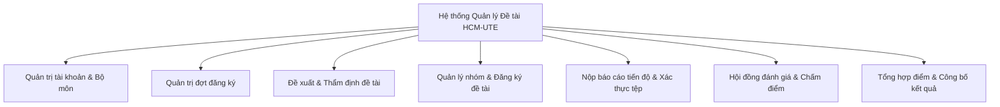

# Tổng quan hệ thống: Hệ thống Quản lý Đề tài Sinh viên HCM-UTE

## 1. Giới thiệu tổng quan

**Hệ thống Quản lý Đề tài Sinh viên HCM-UTE** (`vn.edu.hcmute:topic-management`) là một nền tảng ứng dụng web quản lý học vụ toàn diện, được phát triển phục vụ công tác quản lý đề tài học thuật của **Khoa Công nghệ Thông tin - Trường Đại học Sư phạm Kỹ thuật TP. Hồ Chí Minh (HCM-UTE)**.

Hệ thống số hóa và tự động hóa toàn diện vòng đời quản lý đề tài học thuật của sinh viên, bao gồm các hình thức:
- **Đề tài môn học chuyên ngành (`COURSE`)**
- **Nghiên cứu khoa học sinh viên (`NCKH`)**
- **Tiểu luận chuyên ngành (`TLCN`)**
- **Khóa luận tốt nghiệp (`KLTN`)**

Nền tảng cung cấp một môi trường tương tác thống nhất kết nối 4 đối tượng người dùng: **Ban Chủ nhiệm Khoa (Trưởng khoa)**, **Trưởng Bộ môn**, **Giảng viên (Hướng dẫn / Phản biện / Hội đồng)**, và **Nhóm sinh viên thực hiện**.

---

## 2. Mục tiêu chính & Giá trị mang lại

1. **Chuẩn hóa quy trình học vụ**: Thay thế hoàn toàn các biểu mẫu giấy tờ và bảng tính phân tán bằng máy trạng thái số (state machine) có kiểm soát thời hạn chặt chẽ theo từng đợt đăng ký.
2. **Đảm bảo tính liêm chính & minh bạch học thuật**: Thực thi nghiêm ngặt các quy chế của nhà trường: ngăn chặn xung đột lợi ích (giảng viên hướng dẫn không được tham gia hội đồng chấm đề tài của mình), cô lập nhóm sinh viên theo từng đợt đăng ký, nộp báo cáo tuần tự theo giai đoạn và tổng hợp điểm minh bạch.
3. **Cộng tác trực tuyến theo thời gian thực**: Cung cấp cho sinh viên, giảng viên và lãnh đạo khoa hệ thống dashboard thống kê trực quan, thông báo cập nhật tức thời và tra cứu kết quả đánh giá minh bạch ngay sau khi công bố.
4. **Bảo mật và toàn vẹn dữ liệu**: Kiểm soát truy cập dựa trên vai trò (RBAC), cô lập dữ liệu theo bộ môn, tự động vô hiệu hóa phiên làm việc khi thay đổi mật khẩu và kiểm tra cấu trúc an toàn đối với các tệp báo cáo tải lên.

---

## 3. Các nhóm người dùng & Trách nhiệm

Hệ thống phân định rõ 4 vai trò người dùng trong tổ chức:

| Vai trò | Mã vai trò | Phạm vi & Trách nhiệm chính |
| :--- | :--- | :--- |
| **Trưởng khoa / Quản trị viên** | `ROLE_DEAN` | Quyền quản trị cao nhất cấp Khoa. Khởi tạo và thiết lập các đợt đăng ký, quản lý danh sách người dùng và bộ môn, đề xuất các đề tài liên bộ môn, thành lập hội đồng đánh giá, phân công hội đồng cho nhóm sinh viên và phê duyệt công bố điểm chính thức. |
| **Trưởng bộ môn** | `ROLE_HEAD_OF_DEPT` | Quản lý chuyên môn cấp Bộ môn. Thẩm định, phê duyệt hoặc từ chối đề xuất đề tài thuộc bộ môn mình quản lý, phân công giảng viên hướng dẫn chính và phụ (`advisor1`, `advisor2`), phê duyệt nhóm sinh viên đăng ký và theo dõi tiến độ bộ môn. |
| **Giảng viên** | `ROLE_LECTURER` | Giảng viên hướng dẫn và thành viên hội đồng. Đề xuất đề tài trong cửa sổ thời gian cho phép, duyệt nhóm đăng ký đề tài của mình, tham gia hội đồng chấm bảo vệ (với vai trò Chủ tịch, Thư ký, Phản biện hoặc Ủy viên), nhập điểm và nhận xét chuyên môn. |
| **Sinh viên** | `ROLE_STUDENT` | Người thực hiện đề tài. Tạo nhóm sinh viên (1–3 thành viên), gửi lời mời tham gia, lựa chọn đề tài phù hợp, nộp báo cáo tiến độ theo từng giai đoạn (Đề cương, Giữa kỳ, Cuối kỳ), theo dõi lịch bảo vệ và xem bảng điểm kết quả. |

---

## 4. Các phân hệ chức năng cốt lõi

### 4.1 Quản trị tài khoản & Bộ môn
- Quản lý tài khoản người dùng với cơ chế chống trùng lặp không phân biệt hoa thường (`case-insensitive`).
- Cập nhật mật khẩu kèm cơ chế tự động hủy phiên đăng nhập cũ trên các thiết bị khác.
- Phân bổ giảng viên vào từng bộ môn chuyên môn.
- Cơ chế giới hạn số lần đăng nhập sai (`LoginAttemptService`) chống tấn công vét cạn.

### 4.2 Quản trị vòng đời đợt đăng ký
- Cơ chế 4 mốc thời gian độc lập: **Cửa sổ đề xuất của Giảng viên** (`lecturer_start` $\rightarrow$ `lecturer_end`) nối tiếp bởi **Cửa sổ đăng ký của Sinh viên** (`student_start` $\rightarrow$ `student_end`).
- Phân loại hình thức đề tài: `COURSE`, `NCKH`, `TLCN`, `KLTN`.
- Kiểm tra tự động các mốc hạn nộp báo cáo và ngày tổ chức hội đồng.
- Cơ chế bảo vệ dữ liệu: Ngăn chặn sửa đổi loại đợt hoặc xóa đợt đăng ký khi đã phát sinh đề tài hoặc nhóm sinh viên.

### 4.3 Đề xuất & Thẩm định đề tài
- Giảng viên đề xuất đề tài kèm số lượng sinh viên tối đa, yêu cầu đầu vào và bộ môn.
- Trưởng khoa có quyền đề xuất đề tài liên ngành hoặc cấp khoa.
- Trưởng bộ môn thẩm định đề tài trước khi cửa sổ sinh viên mở.
- Phân công giảng viên hướng dẫn và kiểm soát chỉ tiêu (quota).

### 4.4 Quản lý nhóm sinh viên & Đăng ký đề tài
- Tạo nhóm với mã nhóm ngẫu nhiên duy nhất, người tạo mặc định là Nhóm trưởng.
- Quản lý lời mời: mời qua MSSV, chấp nhận, từ chối, chuyển quyền nhóm trưởng, rời nhóm hoặc giải tán nhóm.
- Phạm vi nhóm độc lập theo từng đợt: mỗi sinh viên chỉ được tham gia tối đa 1 nhóm trong cùng 1 đợt đăng ký.
- Đăng ký đề tài trực tuyến trong danh mục đề tài đã công bố.
- Khóa hủy đăng ký: nghiêm cấm hủy đăng ký khi nhóm đã bắt đầu nộp báo cáo hoặc đã được lên lịch chấm hội đồng.

### 4.5 Báo cáo tiến độ & Xác thực tài liệu an toàn
- Tiến trình 3 giai đoạn bắt buộc: **Đề cương** $\rightarrow$ **Giữa kỳ** $\rightarrow$ **Cuối kỳ**.
- Kiểm tra cấu trúc tệp an toàn: xác thực header `%PDF-`, trailer `%%EOF`, cấu trúc đối tượng `obj` đối với PDF, hoặc định dạng OpenXML nén hợp lệ đối với DOCX, dung lượng tối đa 10 MB.
- Lưu trữ lịch sử các lần nộp và cung cấp chức năng tải về cho giảng viên, hội đồng.

### 4.6 Hội đồng đánh giá & Tổng hợp kết quả
- Hội đồng bảo vệ gồm 3 đến 5 giảng viên với các vai trò chuyên biệt: **Chủ tịch (`CHAIRPERSON`)**, **Thư ký (`SECRETARY`)**, **Phản biện (`REVIEWER`)** và **Ủy viên (`MEMBER`)**.
- Ràng buộc ngăn chặn xung đột lợi ích: giảng viên hướng dẫn không được tham gia hội đồng chấm đề tài của chính mình.
- Cho phép điều chỉnh thành viên hội đồng tại chỗ khi chưa bắt đầu chấm điểm.
- Từng thành viên hội đồng nhập điểm độc lập kèm nhận xét.
- Chủ tịch hội đồng tổng hợp điểm trung bình cộng khi toàn bộ thành viên đã nhập điểm.
- Trưởng khoa duyệt công bố kết quả học tập cho sinh viên.

---

## 5. Bảng tóm tắt công nghệ

| Thành phần | Công nghệ / Thư viện |
| :--- | :--- |
| **Backend Framework** | Java 21 LTS, Spring Boot 3.5.16, Spring MVC, Spring Security 6, Spring Data JPA |
| **Cơ sở dữ liệu** | MySQL Server 8.0+ (Production) / H2 Database (Kiểm thử & Demo) |
| **Quản lý Migration**| Flyway Database Migration (`database/migration/V2..V5`) |
| **Giao diện người dùng**| Thymeleaf, HTML5, CSS3 Responsive (Thiết kế HCM-UTE), JavaScript thuần ES6+ |
| **Đóng gói & Build** | Apache Maven 3.9+, Maven Wrapper (`mvnw`, `mvnw.cmd`) |
| **Kiểm thử tự động** | JUnit 5 Jupiter, Mockito, Spring Boot Test, H2 In-Memory Suite |

---

## 6. Mục lục tài liệu kỹ thuật trong thư mục `docs/`

Để tìm hiểu chi tiết về từng thành phần của hệ thống, vui lòng tham khảo các tài liệu chuyên sâu:

- **[Kiến trúc hệ thống (SYSTEM_ARCHITECTURE.md)](SYSTEM_ARCHITECTURE.md)**: Mô hình kiến trúc phân tầng, luồng xử lý và chuỗi bộ lọc bảo mật.
- **[Thiết kế Cơ sở dữ liệu (DATABASE_DESIGN.md)](DATABASE_DESIGN.md)**: Sơ đồ ERD chi tiết, mô tả cấu trúc bảng, ràng buộc toàn vẹn và migration.
- **[Quy trình nghiệp vụ (BUSINESS_WORKFLOW.md)](BUSINESS_WORKFLOW.md)**: Chi tiết vòng đời đợt đăng ký, đề xuất, nộp báo cáo và chấm điểm hội đồng.
- **[Tài liệu REST API (API_DOCUMENTATION.md)](API_DOCUMENTATION.md)**: Danh mục các endpoint, payload mẫu và quy tắc mã lỗi HTTP.
- **[Kịch bản kiểm thử thủ công (MANUAL_TESTING_SCENARIO.md)](MANUAL_TESTING_SCENARIO.md)**: Hướng dẫn kiểm thử thủ công từng bước cho kiểm thử viên và người vận hành.
- **[Báo cáo nghiệm thu & xác minh (FINAL_VERIFICATION_REPORT.md)](FINAL_VERIFICATION_REPORT.md)**: Báo cáo khắc phục lỗi audit, 11 kịch bản hồi quy và số liệu kiểm thử.
- **[Hướng dẫn triển khai Production (DEPLOYMENT_GUIDE.md)](DEPLOYMENT_GUIDE.md)**: Hướng dẫn cài đặt máy chủ Linux, dịch vụ systemd, Nginx SSL và sao lưu MySQL.
